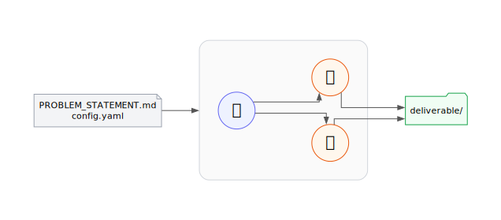

# agentic-f3dasm



---

## Summary

`agentic-f3dasm` adds a single CLI entry point on top of f3dasm:

```bash
uv run python -m f3dasm.agentic <study-dir>
```

Inside `<study-dir>` you place one file — `PROBLEM_STATEMENT.md` — describing the problem, the design parameters, the objective, and any resources the agent should use. The runtime then orchestrates a graph of LLM agent sessions that collectively read, plan, hypothesise, write and execute code, and return a structured deliverable.

The default two-node topology is:

- a **Strategizer** that reads the study tree, asks the user 1–3 clarifying questions, forms a strategy, and delegates concrete tasks;
- an **Implementer** that receives each task, writes and executes Python inside `workspace/`, and returns a structured `## Report`.

The runtime records every delegation as a git commit against an isolated per-run repository, captures per-turn JSONL transcripts, and assembles a deliverable folder at the end.

---

## Statement of need

f3dasm is a Python framework for the canonical DOE loop: *define a domain → sample → evaluate → optimise → repeat*. The framework itself is powerful but requires a researcher who can configure a `Domain`, write a `DataGenerator`, pick a sampler, decide when to stop, and interpret results.

`agentic-f3dasm` is the smallest possible bridge from a `PROBLEM_STATEMENT.md` to a result. The natural unit of work is the briefing a researcher would give a graduate-student assistant — a problem statement, constraints, available resources, and a goal. The agent reads, hypothesises, writes its own code, executes it, falsifies its own claims, and produces a self-contained folder that another human can audit and reproduce without re-running the agent.

---

## Architecture

### Agent class hierarchy

Every node in the run topology is a Python class that inherits from `Agent`. You declare what you want the agent to do by setting class-level attributes — no factory lambdas, no dataclasses, no role strings.

```python
from f3dasm.agentic import Agent, Graph, Edge, AgenticRun

class StrategizerAgent(Agent):
    system_prompt = "You coordinate the search..."
    tools = frozenset({"Done", "WriteMarkdown", "ReadNote"})
    reset_on_checkpoint = False   # persist across checkpoints

class ImplementerAgent(Agent):
    system_prompt = "You execute tasks in the workspace..."
    tools = frozenset({"Bash", "Read", "Write", "Edit", "Glob", "Grep"})
    # reset_on_checkpoint = True  (default)

graph = Graph(
    nodes={
        "strategizer": StrategizerAgent(),
        "implementer": ImplementerAgent(model="claude-haiku-4-5-20251001"),
    },
    edges=(Edge("strategizer", "implementer"),),
    entry="strategizer",   # receives the initial briefing
)
```

At runtime, `AgenticRun` inspects the `Graph` and:
- gives nodes **with outgoing edges** a planner session (orchestration tools injected)
- gives nodes **without outgoing edges** an executor session (native backend tools)

### Tool system — three categories

`Agent.tools` is a `frozenset[str]` of canonical tool names. **Default is `frozenset()` — no tools (opt-in, conservative).** The names fall into two categories you declare, plus one category that is never declared:

#### 1. Native backend tools — declared in `Agent.tools`

Tools executed natively by the backend (Claude SDK built-ins or Ollama bash):

| Canonical name | Claude SDK | Ollama |
|---|---|---|
| `"Bash"` | `Bash` | bash subprocess |
| `"Read"` | `Read` | — (use Bash) |
| `"Write"` | `Write` | — (use Bash) |
| `"Edit"` | `Edit` | — (use Bash) |
| `"MultiEdit"` | `MultiEdit` | — (use Bash) |
| `"Glob"` | `Glob` | — (use Bash) |
| `"Grep"` | `Grep` | — (use Bash) |

#### 2. Protocol closure tools — declared in `Agent.tools`

Python callables built by the f3dasm runtime and passed to the session:

| Canonical name | What it does |
|---|---|
| `"Done"` | Signal end of run with a summary |
| `"WriteMarkdown"` | Write a `.md` note to `strategizer_notes/` |
| `"ReadNote"` | Read any file from the study tree (path-restricted) |

#### 3. Topology-injected tools — **NEVER declared in `Agent.tools`**

The runtime injects these automatically based on the graph. Declaring them in `Agent.tools` has no effect.

| Tool | Injected when |
|---|---|
| `"Delegate"` | Node has outgoing edges |
| `"Parallel"` | Node has outgoing edges |
| `"Debate"` | Node has outgoing edges |
| `"Retry"` | Node has outgoing edges |
| `"Ask"` | Node is the entry node (talks to the human operator) |
| `"FollowUp"` | Node has incoming edges (asks one clarifying question back) |

### Graph and topology

```python
Graph(
    nodes: dict[str, Agent],   # name → Agent instance
    edges: tuple[Edge, ...],   # directed delegation edges
    entry: str,                # which node gets the initial briefing
)
```

An agent with outgoing edges can `Delegate` to any of its named targets. An agent with no outgoing edges is a pure executor — it receives tasks and returns `## Report` blocks. Loops and multi-agent fan-outs are supported.

```python
# Three-node example: one coordinator, two specialists
graph = Graph(
    nodes={
        "coordinator": CoordinatorAgent(),
        "sampler": SamplerAgent(),
        "evaluator": EvaluatorAgent(),
    },
    edges=(
        Edge("coordinator", "sampler"),
        Edge("coordinator", "evaluator"),
    ),
    entry="coordinator",
)
```

### FollowUp protocol

An executor node (with incoming edges) that needs one clarification before it can proceed can respond with:

```
## FollowUp
<single clarifying question>
```

The runtime detects this, returns a `FOLLOW_UP from 'target': <question>` message to the delegating agent, and that agent re-calls `Delegate` with the answer embedded in the intent. This is a response-format protocol — not a live callback — so it has no SDK overhead.

### ADAS compatibility

Every `Agent` subclass has a `forward()` method hook:

```python
class MyCoordinator(Agent):
    def forward(self) -> None:
        """Override for inspectable Python orchestration (ADAS pattern)."""
        ...
```

`inspect.getsource(agent.forward)` returns the Python source of the topology as code — the entry point for ADAS-style meta-agents that read and rewrite orchestration logic. Tool calls are the easy LLM-driven default; `forward()` overrides are the ADAS-searchable path. Both coexist.

---

## Method overview

```text
                ┌──────────────────────────────────────────────┐
 PROBLEM_STATEMENT.md ─▶│  AgenticRun                              │
                │  (~800 lines of Python)                  │
                │  - classifies Agent.tools (3 categories)  │
                │  - injects topology tools from Graph      │
                │  - routes messages via _tool_delegate     │
                │  - git commit per delegation              │
                │  - checkpoint every N delegations         │
                └──┬────────────────────────────────────┬───┘
                   │                                    │
        ┌──────────▼────────┐                 ┌─────────▼──────────┐
        │  StrategizerAgent │                 │  ImplementerAgent  │
        │  (planner session)│                 │  (executor session)│
        │                   │  ## Task        │                    │
        │  ReadNote         │ ──────────────▶ │  Bash / Read /     │
        │  WriteMarkdown    │                 │  Write / Edit …    │
        │  Done             │  ## Report      │                    │
        │  [Ask — entry]    │ ◀────────────── │  [FollowUp — opt]  │
        │  Delegate ──┐     │                 │                    │
        │  Parallel   │     │                 │                    │
        │  Debate     │     │                 │                    │
        │  Retry      │     │                 │                    │
        └─────────────┘     │                 └────────────────────┘
             topology-injected                 native backend tools
             (from Graph edges)                (declared in Agent.tools)
```

**The five non-negotiable commitments:**

1. **f3dasm is first-class and pristine.** No native f3dasm modules are edited. The agentic layer ships as `from f3dasm.agentic import …`.
2. **Composable peer topology.** Agents are peers connected by directed delegation edges. Neither is structurally privileged.
3. **The orchestrator is plumbing.** It routes messages, runs git, and enforces the checkpoint cadence — nothing more. Strategic decisions belong to the entry agent.
4. **Provenance and interpretability are deliverables.** Every delegation is bracketed by a git commit. The deliverable folder includes the solution, the full git log, JSONL transcripts, and the workspace.
5. **Problem-agnostic core.** Nothing in `src/f3dasm/` carries problem-specific names, enums, or constants. Domain content lives entirely in `studies/<study>/PROBLEM_STATEMENT.md`.

---

## Getting started

### Install (with `uv`)

```bash
# Inside the f3dasm repo
uv venv                              # creates ./.venv (Python ≥ 3.10)
uv pip install -e ".[agentic]"       # editable install + agentic extras
```

The `agentic` extras installs `claude-agent-sdk`. You also need the Claude CLI binary on your `PATH` and must log in once interactively (`claude`) so the CLI can authenticate with your Anthropic account.

### Run an existing study

```bash
uv run python -m f3dasm.agentic studies/agentic_modular_resonance
```

`uv run` executes inside `./.venv` automatically. The entry agent will print clarifying questions on stdout and wait for your typed answers, then delegate work. When the run completes, the deliverable lives at `studies/agentic_modular_resonance/runs/<timestamp>/deliverable/`.

### Make your own study

```bash
mkdir studies/my_problem
cat > studies/my_problem/PROBLEM_STATEMENT.md <<'EOF'
# My problem

I want to find (x, y) in [0, 1]² that maximises f(x, y) where
f is implemented in sim.py. Do not run more than 200 evaluations.
EOF
cp my_simulator.py studies/my_problem/sim.py
uv run python -m f3dasm.agentic studies/my_problem
```

### CLI flags and config.yaml

```bash
uv run python -m f3dasm.agentic <study-dir> \
    [--model claude-haiku-4-5-20251001] \
    [--checkpoint-every 30]
```

Or drop a `config.yaml` in the study directory:

```yaml
model: claude-haiku-4-5-20251001
backend: claude          # or: ollama
budget: "01:00:00"       # HH:MM:SS wall-clock budget
checkpoint_every: 30
eval_budget: 5000        # max evaluations (if tracked in report.numbers)
```

CLI flags override config values; config values override backend defaults.

---

## Python API

For programmatic use or custom topologies:

```python
from f3dasm.agentic import Agent, Graph, Edge, AgenticRun, StudyConfig

class Coordinator(Agent):
    system_prompt = "You plan the search."
    tools = frozenset({"Done", "WriteMarkdown", "ReadNote"})
    reset_on_checkpoint = False

class Worker(Agent):
    system_prompt = "You run experiments."
    tools = frozenset({"Bash", "Read", "Write", "Edit"})

graph = Graph(
    nodes={"coordinator": Coordinator(), "worker": Worker()},
    edges=(Edge("coordinator", "worker"),),
    entry="coordinator",
)

run = AgenticRun(
    study_dir="studies/my_problem",
    graph=graph,
    study_config=StudyConfig(budget=timedelta(hours=1)),
)
deliverable = run.execute()   # returns Path to deliverable/
```

### Key public symbols

| Symbol | Description |
|---|---|
| `Agent` | Base class for all agent nodes |
| `Graph` | Directed agent topology |
| `Edge` | Directed delegation edge |
| `AgenticRun` | Orchestrator entry point |
| `StudyConfig` | Config loaded from `config.yaml` |
| `Delegation` | Round-trip task+report envelope |
| `Task` | Request half of a delegation |
| `Report` | Parsed response half of a delegation |
| `Backend` | Frozen bundle: `session_factory`, `preflight`, `name`, `default_model` |
| `CLAUDE_BACKEND` | Default Claude CLI backend |
| `register_backend` | Register a custom named backend |
| `parallel` | Fan-out firing primitive |
| `retry` | Retry firing primitive |
| `debate` | Debate firing primitive |
| `LookupDataGenerator` | Nearest-neighbour pool evaluator (Implementer-usable) |

---

## Backends

### Claude (default)

Uses the Claude Agent SDK and the `claude` CLI binary. Both planner and executor sessions are backed by `_ClaudeAgentSession`, which combines native SDK tools and an in-process MCP server for closure tools in a single session.

Canonical→Claude tool name mapping: all names are identical (`Bash`→`Bash`, `Read`→`Read`, etc.).

### Ollama

Uses a locally-running Ollama server. Only `"Bash"` is supported as a native tool; file I/O should be done via bash commands (`cat`, `echo`, `find`, `grep`). Closure tools (protocol + topology) work identically to Claude.

```yaml
# config.yaml
backend: ollama
model: qwen2.5:7b
```

### Custom backends

```python
from f3dasm.agentic import Backend, register_backend

my_backend = Backend(
    name="my-llm",
    default_model="my-model-v1",
    session_factory=my_session_factory,
    preflight=my_preflight_fn,
)
register_backend("my-llm", my_backend)
```

`session_factory` signature: `(*, system_prompt, model, native_tools, closure_tools, study_dir) -> AgentSession`

---

## Repository layout (agentic-only)

```text
src/f3dasm/agentic/
    __init__.py            # public API
    __main__.py            # CLI entry point

src/f3dasm/_src/agentic/
    agent_runtime.py       # AgenticRun orchestrator, tool classification,
                           # _tool_delegate, FollowUp detection, git helpers,
                           # checkpoint logic, transcript recording
    agent_prompts.py       # all system prompts and template constants
    backends/
        base.py            # Agent, Graph, Edge, Backend, AgentSession,
                           # NATIVE_TOOL_NAMES, PROTOCOL_CLOSURE_NAMES,
                           # _TOPOLOGY_INJECTED_TOOL_NAMES
        claude.py          # _ClaudeAgentSession, CLAUDE_BACKEND,
                           # canonical→Claude tool mapping
        ollama.py          # _OllamaAgentSession, OLLAMA_BACKEND,
                           # canonical→Ollama mapping
    lookup.py              # LookupDataGenerator
    optimizer.py           # AgenticOptimizer (f3dasm Optimizer interface)
    primitives.py          # parallel, retry, debate (Python-level)
    stores.py              # AnalysisBase, TaskRegistry, ContextSlice

tests/agentic/
    test_agent_runtime.py
    test_agent_prompts.py
    test_lookup.py
    test_ollama_backend.py

studies/<study>/
    PROBLEM_STATEMENT.md   # the only required file
    config.yaml            # optional: model, backend, budget, …
    workspace/             # Implementer scratch (persists across runs)
    runs/<ts>/             # one folder per run
        .git/              # provenance (isolated per-run bare repo)
        strategizer_notes/ # planner .md lab notebook
        transcripts/       # JSONL per-turn transcripts
        run.log
        deliverable/
            solution.md
            replication/   # mirror of workspace/
            git_log.txt
            transcripts/
            run.log
```

---

## Built-in safeguards

- **Strategizer prompts** name and mitigate anchoring bias, confirmation bias, availability bias, role drift, sycophancy, and premature convergence.
- **Implementer prompts** enforce a SelfAI-style three-stage reasoning protocol (Restate / Inventory / Plan) before any code execution, and a BORA-style structured `## Report` block on output.
- **One-shot corrective retry** fires when the report can't be parsed; a Reflexion-style `REFLECT:` diagnostic surfaces if the retry also fails.
- **FollowUp protocol** gives executors a single clarifying question back to the delegating agent before committing to an approach.
- **Budget enforcement**: wall-clock (`budget`) and evaluation-count (`eval_budget`) limits checked before every delegation.
- **Git provenance**: every delegation is bracketed by a git commit so any state can be reproduced.

---

## Studies in this repo

| Study | Description |
|---|---|
| `agentic_modular_resonance` | Two-parameter integer optimisation: maximise `ord(k, m) / ln(m)` over `k ∈ [2,50]`, `m ∈ [1000,100000]`. Uses f3dasm `Domain` + `DataGenerator`. Brute-force confirmed optimum: `(k=6, m=99991, resonance ≈ 8685)`. |
| `agentic_black_box_8d` | 8-dimensional black-box optimisation with unknown landscape. |
| `agentic_supercompressible_3d` | Supercompressible metamaterial design (Bessa 2019 benchmark, 3D). |
| `agentic_supercompressible_7d` | Same benchmark, 7D parameter space. |
| `agentic_project_euler_078` | Coin partitions (smoke test; no f3dasm DOE). |

---

## Authorship

- **Elvis Aguero** (`elvis_alexander_aguero_vera@brown.edu`) — design, architecture, implementation.
- Bessa Research Group, Brown University — context and host project.

---

## Community support

- **Architecture questions / bug reports:** open an issue on [`f3dasm`](https://github.com/bessagroup/f3dasm) with the prefix `[agentic]` in the title.
- **Design proposals:** include a citation from `docs/specs/literature-map.md` where possible.

---

## License

`agentic-f3dasm` inherits the host project's **BSD-3-Clause** license. See `LICENSE` at the repository root.

---

## Status

This is the **v2 API of agentic-f3dasm**: class-based `Agent` hierarchy, declarative `Graph` topology, unified `Backend.session_factory`, and a three-category tool system. It has been exercised end-to-end against the `agentic_modular_resonance` study with Haiku 4.5; the deliverable folder is reproducible via the agent-written `replicate.py`, and an independent brute-force solver agrees with the agent's answer on that benchmark.

Planned next: (1) hypothesis-log enforcement gate before `Done()` may fire; (2) cost monitoring; (3) ADAS-style meta-agent that reads and rewrites `Agent.forward()` topology via `inspect.getsource`; (4) multi-agent parallel topologies. See `docs/specs/architecture.md` for the full roadmap.
