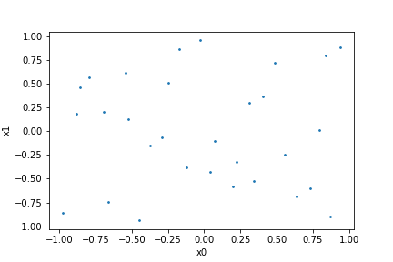
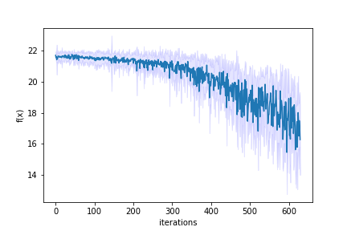

Optimizing a benchmark function
===============================

We are going to take a look at the different functionalities:

* Create a design of experiments
* Sample from this space
* Evaluate the samples using a well-known benchmark function
* Iteratively find the minimum of the loss-landscape using a global optimizer
* Look at one of the example experiments: 20D Ackley optimization with CMAES

import the :mod:`f3dasm` package, and :mod:`numpy`:

.. code-block:: python

    import f3dasm
    import numpy as np

make sure that we specify a `seed`:

.. code-block:: python

    seed = 42

Design: creating the design space
^^^^^^^^^^^^^^^^^^^^^^^^^^^^^^^^^

Define the parameters :math:`x_0`, :math:`x_1` and the output :math:`y`.

We add a :attr:`~f3dasm.base.space.ContinuousParameter.lower_bound` and an :attr:`~f3dasm.base.space.ContinuousParameter.upper_bound` to define the box-constraints:

.. code-block:: python

    # Input parameters
    x1 = f3dasm.ContinuousParameter(name="x0", lower_bound=-1., upper_bound=1.)
    x2 = f3dasm.ContinuousParameter(name="x1", lower_bound=-1., upper_bound=1.)

and an output parameter :math:`y` that is continuous and not constraint:

.. code-block:: python

    # Output parameters
    y = f3dasm.ContinuousParameter(name="y")

We construct 2 lists of these parameters and the designspace: 

.. code-block:: python

    # Create lists of parameters
    input_space = [x1, x2]
    output_space = [y]

And the design space with the :class:`f3dasm.base.design.DesignSpace` class

.. code-block:: python

    # Construct the design space
    design_manually = f3dasm.DesignSpace(input_space=input_space, output_space=output_space)

I have created a helper function that makes it easier to construct a n-dimensional continuous, single-objective space:

.. code-block:: python

    dim = 2
    domain = np.tile([-1., 1.], (dim,1))
    design = f3dasm.make_nd_continuous_design(bounds=domain, dimensionality=dim)

    # Check if they are equal
    assert design_manually == design

What's next? We can sample from this design space with the **sampling** block!

Latin Hypercube Sampler
^^^^^^^^^^^^^^^^^^^^^^^
To sample from the design space, we need a sampler. We choose the :class:`~f3dasm.sampling.samplers.LatinHypercubeSampling` sampler:

.. code-block:: python

    # Construct sampler
    samples = f3dasm.sampling.LatinHypercubeSampling(design=design, seed=seed)

By invoking the :meth:`~f3dasm.base.samplingmethod.SamplingInterface.get_samples` method, we obtain samples according to the sampling strategy:

.. code-block:: python

    N = 30 # Number of samples
    data = samples.get_samples(numsamples=N)

We can plot the datapoints with the :meth:`~f3dasm.base.data.Data.plot()` function:

.. code-block:: python

    data.plot(input_par1='x0', input_par2='x1')

As you could see earlier, the output values are all `NaN`. Let's evaluate the samples with the **simulation** block!

Simulation: Evaluating a benchmark function
^^^^^^^^^^^^^^^^^^^^^^^^^^^^^^^^^^^^^^^^^^^

Several benchmark function have been implemented to work with **continuous and single-objective** optimization problems.

These functions require an input-vector :math:`\mathbf{x}` and output a scalar :math:`f(\mathbf{x})`

The :class:`~f3dasm.functions.pybenchfunction.Levy` function is a well-known, multimodal function:

.. math::

    f(\textbf{x}) = \sin^2 (\pi w_1) + \sum_{i = 1}^{D - 1} (w_i - 1)^2 \left( 1 + 10 \sin^2 (\pi w_i + 1) \right) + (w_d - 1)^2 (1 + \sin^2 (2 \pi w_d)) \\ w_i = 1 + \frac{x_i - 1}{4}

*The original input domain is (-10, 10), but we scale these boundaries to the boundaries our input space*

First we create such a function by creating an object from the :class:`~f3dasm.functions.pybenchfunction.Levy` class

.. code-block:: python

    f = f3dasm.functions.Levy(dimensionality=dim, seed=seed, scale_bounds=domain)

The global minima are known for these functions:

.. code-block:: python

    x_min, y_min = f.get_global_minimum(dim)
    print(f"The global minimum is {y_min} at position {x_min}")
    >>> The global minimum is [[1.49975978e-32]] at position [[-0.25091976  0.90142861]]

We can plot a three-dimensional represtation of two input parameters :math:`x_1` and :math:`x_2`` with the `plot()` function

.. code-block:: python

    f.plot(px=100, domain=domain)

.. image:: ../img/functions/Levy.png

Evaluating the function is easy, just pass either:

* the :class:`~f3dasm.base.data.Data` object to it: :meth:`~f3dasm.base.data.Data.get_input_data`
* or a 2D numpy array

and all the samples will be evaluated.
The output will be a `np.ndarray`

.. code-block:: python

    x = data.get_input_data()

By calling the :meth:`~f3dasm.base.data.Data.add_output` option, we can add individual columns or overwrite data to our DataFrame:

.. code-block:: python

    data.add_output(output=f(x))

We can create a contour plot with the samples coordinates with the :meth:`~f3dasm.base.function.Function.plot_data()` function:

.. code-block:: python

    f.plot_data(data,px=300,domain=domain)

.. image:: ../img/contour_samples.png

*The red start will indicate the best sample*

Now we will take a look how we can find the minimum of this loss-function with an **optimizer**!

Optimization: CMAES optimizer
^^^^^^^^^^^^^^^^^^^^^^^^^^^^^

We will use the CMAES optimizer to find the minimum. We can find an implementation in the :mod:`~f3dasm.optimization` module:

.. code-block:: python

    optimizer = f3dasm.optimization.CMAES(data=data)

By calling the :meth:`~f3dasm.base.optimization.Optimizer.iterate()` method and specifying the function and the number of iterations, we will start the optimization process:

.. code-block:: python

    optimizer.iterate(iterations=20, function=f)

After that, we can extract the data:

.. code-block:: python

    cmaes_data = optimizer.extract_data()

and create a contour plot again:

.. code-block:: python

    f.plot_data(data=cmaes_data,px=300, domain=domain)

.. image:: ../img/contour_data.png

Experiment: Multiple realizations of SGA on 20D Ackley function
^^^^^^^^^^^^^^^^^^^^^^^^^^^^^^^^^^^^^^^^^^^^^^^^^^^^^^^^^^^^^^^

Now we take a look at an example of an experiment where use the following blocks to optimize a 20D :class:`~f3dasm.functions.pybenchfunction.Ackley` function with the :class:`~f3dasm.optimization.pygmo_implementations.CMAES` optimizer over 10 different realizations:

.. image:: ../img/blocks.png

.. code-block:: python

    import matplotlib.pyplot as plt
    import pandas as pd

    # Define the blocks:
    dimensionality = 20
    iterations = 20
    realizations = 10

    hyperparameters= {} # If none are selected, the default ones are used

    domain = np.tile([-1., 1.], (dimensionality,1))
    design = f3dasm.make_nd_continuous_design(bounds=domain, dimensionality=dimensionality)
    data = f3dasm.Data(design)

    # We can put them in a dictionary if we want

    implementation = {
    'realizations': realizations,
    'optimizer': f3dasm.optimization.CMAES(data=data, hyperparameters=hyperparameters), 
    'function': f3dasm.functions.Ackley(dimensionality=dimensionality, noise=False, scale_bounds=domain),
    'sampler': f3dasm.sampling.LatinHypercubeSampling(design, seed=seed),
    'iterations': iterations,
    }

The `run_multiple_realizations()` function will be the pipeline of this experiment:

.. code-block:: python

    results = f3dasm.run_multiple_realizations(**implementation)

.. code-block:: python

    def plot_results(results):
        mean_y = pd.concat([d.get_output_data() for d in results], axis=1).mean(axis=1)
        std_y = pd.concat([d.get_output_data() for d in results], axis=1).std(axis=1)
        
        fig, ax = plt.figure(), plt.axes()
        ax.plot(mean_y)
        ax.set_xlabel('iterations')
        ax.set_ylabel('f(x)')
        ax.fill_between(np.arange(len(mean_y)), mean_y-1.96*std_y, mean_y+1.96*std_y, color='b', alpha=.1)
        #ax.set_yscale('log')
        fig.show()

    plot_results(results)

