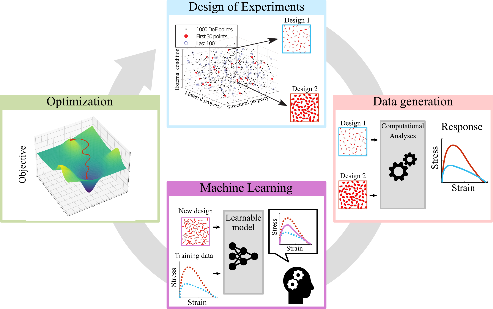

<p align="center">
  
</p>

---

# Summary
**f3dasm** introduces a general and user-friendly data-driven Python package for researchers and practitioners working on design and analysis of materials and structures.

<p align="center">
  
</p>

---

# Quick Example

```python
from f3dasm.design import Domain
from f3dasm import ExperimentData, create_sampler, create_datagenerator, create_optimizer

# Define a 2D parameter space
domain = Domain()
domain.add_float(name='x0', low=-1.0, high=1.0)
domain.add_float(name='x1', low=-1.0, high=1.0)

# Sample, evaluate and optimize
data = ExperimentData(domain=domain)
data = create_sampler('random', seed=42)(data=data, n_samples=20)

evaluator = create_datagenerator('sphere')
evaluator.arm(data=data)
data = evaluator.call(data=data)
```

---

# Key Features

- **Modular design** — Flexible interfaces to easily integrate your own models and algorithms. [Learn more](notebooks/data-driven/blocks.ipynb)
- **Automatic data management** — The framework handles all I/O processes for you. [Learn more](notebooks/experimentdata/experimentdata.ipynb)
- **Easy parallelization** — Run experiments in parallel on local machines or HPC clusters. [Learn more](notebooks/data-driven/cluster.ipynb)
- **Built-in defaults** — Comes with [benchmark functions](defaults.md#implemented-benchmark-functions), [optimizers](defaults.md#implemented-optimizers), and [samplers](defaults.md#implemented-samplers) out of the box.
- **Hydra integration** — Manage experiment configurations with [Hydra](https://hydra.cc/). [Learn more](notebooks/hydra/usehydra.ipynb)

---

# Getting started
The best way to get started is to:

* Read the [overview](overview.md) section, containing a brief introduction to the framework and a statement of need.
* Understand the [core concepts](concepts.md) behind the framework.
* Follow the [installation instructions](installation.md) to get going!
* Check out the tutorials section, containing a collection of examples to get you familiar with the framework.

---

# Authorship & Citation
**f3dasm** is created and maintained by **Martin van der Schelling**[^1].

[^1]: PhD Candidate, Delft University of Technology.  
[Website](https://mpvanderschelling.github.io/) | [GitHub](https://github.com/mpvanderschelling/)

--8<-- ".citation.md"