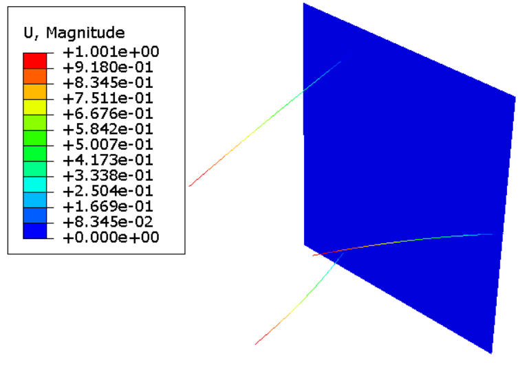
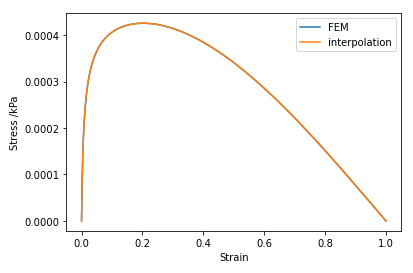
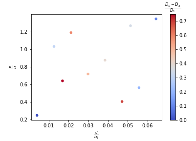
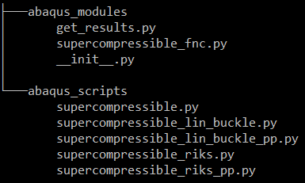
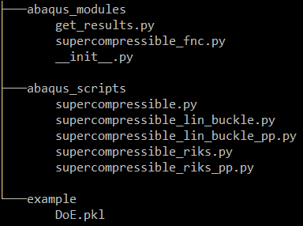

.. basic_supercompressible:

A Basic Example Starting From Scripts
=====================================

.. |f3dasm| replace:: F3DASM
.. _f3dasm: https://github.com/bessagroup/F3DASM

.. |abaqus| replace:: Abaqus
.. _abaqus: https://www.3ds.com/products-services/simulia/products/abaqus/

.. |riks| replace:: Riks analysis
.. _riks: https://abaqus-docs.mit.edu/2017/English/SIMACAEANLRefMap/simaanl-c-postbuckling.htm>

.. |linbuck| replace:: linear buckling analysis
.. _linbuck: https://abaqus-docs.mit.edu/2017/English/SIMACAEANLRefMap/simaanl-c-eigenbuckling.htm

.. |salib|  replace:: SALib
.. _salib: https://salib.readthedocs.io/en/latest/

Setting up the problem
----------------------

Assume you are interested in designing a new supercompressible metamaterial. After reading tons of information about depoyable structures and impact absorbers, you start thinking that merging design ideas from both structures may let you discover an outstanding supercompressible metamaterial.

With this out-of-box thought in mind, you come up with a parameterized structure, as follows:

.. figure:: images/supercompressible_3d.jpg
   :scale: 40%
   :align: center

Your **geometry** is defined by the top and bottom diameters, :math:`D_1` and :math:`D_2`, the height :math:`P` and the cross-section parameters of the vertical longerons: the cross-sectional area :math:`A`, moments of inertia :math:`I_x` and :math:`I_y`, and torsional constant :math:`J`.

The **isotropic material** is defined by its elastic constants: Young's modulus :math:`E` and shear modulus  :math:`G`.

Due to the principle of superposition both the geometric and material parameters can be scaled by one of its dimensions/properties (here :math:`D_1` and :math:`E`). Therefore, your design will be parameterized by the following variables:

.. math::

   \frac{D_1-D_2}{D_1},\ \frac{P}{D_1},\ \frac{I_x}{D_1^4},\ \frac{I_y}{D_1^4},\ \frac{J}{D_1^4},\ \frac{A}{D_1^2}, \frac{G}{E}

After reflecting for a while, you decide to reduce the dimensionality of your problem, because the flexibility given by the 7-dimensional problem may be a burden and you have heard before about the `curse of dimensionality <https://en.wikipedia.org/wiki/Curse_of_dimensionality>`_. You come up with a more amenable design that is parameterized by:

.. math::

    \frac{d}{D_1},\ \frac{D_2-D_1}{D_1},\ \frac{P}{D_1}

Now you don't have to concern yourself with the choice of the longeron's cross-section nor the material.

It's now time to explore the design space and find out the oustanding supercompressible metamaterial you are looking for! But wait... from where should you begin?

Should you go to the lab and randomly pick values for your design variables? Should you try to model your structure and gain insights about your problem before going to the lab?

Luckily, in one of your procastination moments you stumbled across a video that shed some light on what to do next!

.. raw:: html

   <iframe width="560" height="315" src="https://www.youtube.com/embed/cWTWHhMAu7I" frameborder="0" allow="accelerometer; autoplay; clipboard-write; encrypted-media; gyroscope; picture-in-picture" allowfullscreen></iframe>

|

From the insights of all your research, you desguise a plan to efficiently tackle your problem:

1. Create a numerical model
2. Set up a design of experiments
3. Run the numerical model for each design point
4. Create a dataset mapping by input points into desirable outputs

Let's pass to action!

Create a numerical model
------------------------

Your design exploits the geometric imperfections of a structure. Such behaviour is highly non-linear. To simulate it, you choose to perform a |riks|_.

But wait, there's a problem! How can your numerical model exploit imperfections that do not exit (when you create the model, your geometry is *perfect*)? Well, there's several possibilities, but a straightforward one is to start with a |linbuck|_, and then feed your |riks|_ with the resultant imperfections.

Since you are an |abaqus|_ expert, you open the GUI and start creating your linear buckling model. When you finish modelling, you open the |abaqus|_ replay file, you clean it and end up with a script similar to `this <https://github.com/bessagroup/F3DASM/blob/master/examples/supercompressible/abaqus_scripts/supercompressible_lin_buckle.py>`_.

.. Tip::

    Instead of spending too much time trying to go from the |abaqus|_'s replay file to a runnable script, why to not use the |abaqus|_ utils provided by |f3dasm|_?

You run your script once for a randomly chosen design and check the first mode in the GUI:

But you know that if you want to get the most out of your model, you need to automate the post-processing. This time, after all the knowledge you acquired developing the code to create the model, you go directly into Python and quickly come up with `this script <https://github.com/bessagroup/F3DASM/blob/master/examples/supercompressible/abaqus_scripts/supercompressible_lin_buckle_pp.py>`_.

For this model, you chose to store information about coilability (that you define based on the ability the longerons have to rotate), the critical loads (because you are interested in predict critical loads) and the maximum displacements (that will serve to compute the amplitude of the imperfections).

Now it's time to repeat the steps for the Riks model. You take a close look to your `first script <https://github.com/bessagroup/F3DASM/blob/master/examples/supercompressible/abaqus_scripts/supercompressible_lin_buckle.py>`_ and you realize that almost all the code is reusable in this new model. In fact, you just have to change the way you create the step and set the boundary conditions, add contact and request different field and history outputs. It is a piece of cake to come up with `this script <https://github.com/bessagroup/F3DASM/blob/development/examples/supercompressible/abaqus_scripts/supercompressible_riks.py>`_!

You run the new scrip and check the way the model deforms in the GUI:

.. figure:: images/riks_1.PNG
   :scale: 50%
   :align: center

Everything looks fine!

Again, you want to go a little further, and therefore you automate the model `post-processing <https://github.com/bessagroup/F3DASM/blob/development/examples/supercompressible/abaqus_scripts/supercompressible_riks_pp.py>`_. You store information about the displacements, reaction forces and deformations. The first two allow you to create plots as the following, whereas the last gives information about material yielding.

You haven't started applying Machine Learning yet and you are already astonished: the behaviour of the structure is exactly what you are looking for!

It is now time to go further!

Set up the design of experiments
--------------------------------

In order to get the most out of your parameterized design you know that you have to explore your design space. The first step towards it is to define the bounds of the design variables:

.. math::

   \frac{d}{D1} \in  [0.004, 0.073],\ \frac{P}{D_1} \in  [0.25, 1.5],\ \frac{D_1-D_2}{D_1} \in [0, 0.8]

Now that you bounded the design space, you have to choose the points to simulate wisely, to ensure you do the best with the minimum cost (being it computational time in this case). Among dozens of design of experiment strategies, you decide to go with `Sobol sequence <https://en.wikipedia.org/wiki/Sobol_sequence>`_. You know that |salib|_ offers such design of experiments strategy. Nevertheless, you don't want to learn another Python library (you have already spent too much time learning Abaqus scripting!), so you search inside |f3dasm|_ how to proceed and you discover that it interfaces with |salib|_, simplifying you job.

All you have to do is to create a ``dict`` with your variables and respective bounds:

>>> doe_variables = {'ratio_d': [0.004, 0.073],
...                  'ratio_pitch': [.25, 1.5],
...                  'ratio_top_diameter': [0., 0.8]})

And then call ``create_doe``:

>>> points = create_doe(n_pts, doe_variables, sample_strat='sobol')

The output of ``create_doe`` is a Pandas dataframe where each row corresponds to a datapoint and each column to a design variable.

.. tip::

    If you want to ensure a specific column order in the Pandas dataframe created, you have to use ``OrderedDict``, since `dict` is an unordered collection.

    >>> from collections import OrderedDict
    >>> doe_variables = OrderedDict((('ratio_d', [0.004, 0.073]),
    ...                              ('ratio_pitch', [.25, 1.5]),
    ...                              ('ratio_top_diameter', [0., 0.8])))

The next plot shows the first 10 datapoint generated:

At this point you are start wondering: how can |f3dasm|_ run the scripts you have created with different input variables? It can't! First **you need to transform your scripts into modules**, i.e. you have to put your code inside **functions**.

.. Attention::

    |f3dasm|_ requires that you rewrite your scripts into modules that contain functions.

How hard can it be? If you have been careful enough to define everything you want to change as variables, then **all you need to do is simply indent your code and define the function headers**.

You don't believe? Take a look to `this script <https://github.com/bessagroup/F3DASM/blob/development/examples/supercompressible/abaqus_scripts/supercompressible.py>`_ (that is the merging of all the scripts mentioned above). Now, take a look to the `module <https://github.com/bessagroup/F3DASM/blob/development/examples/supercompressible/abaqus_modules/supercompressible_fnc.py>`_ where all the required functions are defined. We have kept as comment everything that is not required anymore.

Simple, isn't it? But you are right, we demand something else from you: **the definition of the job and its submission is responsability of** |f3dasm|_, so please also comment or delete that lines.

.. Attention::

    Your functions are not responsable for creating and submitting jobs. |f3dasm|_ takes responsability for it!

Wait, there's still a last thing we need from you (and we assure you that it is really our last demand regarding the creation and post-processing of the numerical models): the post-processing functions must return the collected data (it is obvious, isn't it?). The simplest way to do it is to return a ``dict`` with all the collected variables. But there's no special requirement here, since as you will see later you are the responsable to convert your raw data into Machine Learning amenable outputs.

.. Attention::

   Your post-processing functions must return the collected data.

.. Tip::

   Avoid storing unnecessary data because if you have to run hundreds of simulations the storage space required will be enourmous.

Let's just do a quick recap before moving on. At this point you have: created scripts to run and post-process linear buckling and Riks analyses; applied design of experiments to create simulation points; transformed the scripts into modules.

What's missing? Well, now you just have to tell |f3dasm|_ where everything is and ask it to run the simulations.

Run the numerical model for each design point
---------------------------------------------

Have you noticed the functions in the `module <https://github.com/bessagroup/F3DASM/blob/development/examples/supercompressible/abaqus_modules/supercompressible_fnc.py>`_ we have created require a larger number of input variables than our design of experiments (e.g. number of longerons)? We have done it to have more flexibility. Nevertheless, it means that you have to tell |f3dasm|_ which values that variables will take during the simulations. |f3dasm|_ call this kind of variables **fixed variables**. Let's specify them:

>>> fixed_variables = {'n_longerons': 3,
...                    'bottom_diameter': 100.,
...                    'young_modulus': 3500.,
...                    'shear_modulus': 1287., }

.. Attention::

   If your functions require variables that are common to all datapoints (but, nevertheless, have to be specified because e.g. they do not have default values or you want them to take values different than the default values), then you have to provide a ``dict`` with its names and values.

In this problem, there's still another variable (``imperfection``) that is not a design of experiments variable, nor a *fixed variable*: this variable changes across datapoints but is not controlled by the design of experiments. |f3dasm|_ calls this kind of variables **additional variables** (what a lack of imagination!). Let's specify it:

>>> additional_variables = {'imperfection': imperfections}

``imperfections`` in the above code is an array (it can be a ``list``, ``tuple``, ``numpy.ndarray``, etc). Don't spend too much time understanding how we have generated imperfections. Just keep in mind it comes from a lognormal distribution (so, it is a stochastic variable).

.. Attention::

    If you have variables that change across datapoints, but are not controlled by the design of experiments, then you have to pass it via a ``dict`` with its names and values. The values must be array-like with at least as many points as design of experiment points.

You are almost there. At this moment, you have to inform |f3dasm|_ about the specifications of the simulations you want to run. That's the responsability of ``create_sim_info``. Let's do it for the linear buckling model:

>>> sim_info_buckle = create_sim_info(
...     name='SUPERCOMPRESSIBLE_LIN_BUCKLE',
...     abstract_model='abaqus_modules.supercompressible_fnc.lin_buckle',
...     job_info={'name': 'Simul_supercompressible_lin_buckle'},
...     post_processing_fnc='abaqus_modules.supercompressible_fnc.post_process_lin_buckle')

The argument names are self-explanatory, but let's dig deeper into it. ``name`` specifies the simulation name. ``abstract_model`` locates the function that generates the model. ``job_info`` stores the required job arguments. ``post_processing_fnc`` locates the function that post-processes the model.

.. Tip::

    All the values of ``job_info`` are passed to |abaqus|_'s job function. Therefore, even though you don't have direct control over job creation and submission, you have not lost any flexibility.

.. Important::

    ``job_info`` must contain at least the key ``name``.

The location of the functions must be given with reference to the **main directory**. As you noticed when you took a look to our scripts, our main directory is called ``supercompressible`` and has the following structure:

Don't think about ``abaqus_modules/__init__.py`` or ``abaqus_modules/get_results.py``. We'll come to them later.

.. Attention::

   Give the location of the functions with reference to the **main directory**, i.e. the directory from which you launch your simulations.

You are now able to do it by yourself for the Riks model, right?

.. Admonition:: Riks model specification
   :class: dropdown

   >>> sim_info_riks = create_sim_info(
   ...     name='SUPERCOMPRESSIBLE_RIKS',
   ...     abstract_model='abaqus_modules.supercompressible_fnc.riks',
   ...     job_info={'name': 'Simul_supercompressible_riks'},
   ...     post_processing_fnc='abaqus_modules.supercompressible_fnc.post_process_riks')

Easy! Now, you just have to specify the order of simulations. How? Use any ordered array-like object (e.g. a ``list``):

>>> sim_info = [sim_info_buckle, sim_info_riks]

Before you finally finish this step, you decide to create another ``dict`` that contains information that is not required for the simulations, but may be useful for future reference or e.g. results replication. In this case, you only store information about the ``seed`` and the distribution of the ``imperfection`` variable.

>>> additional_info = {'imperfection_dist': imperfection_dist,
...                    'seed': seed}

The last step before launching the simulations is to aggregate all the information you have created in a file. That's ``create_main_file`` responsability:

>>> create_main_file(example_name, doe_variables, points, sim_info,
...                  fixed_variables=fixed_variables,
...                  additional_variables=additional_variables,
...                  additional_info=additional_info,)

If you look to your directory now, you have a folder called ``example`` (your ``example_name``) that contains a ``pickle`` file:

``example/DoE.pkl`` feeds the functions that run and post-process simulations. Besides the passed information, ``create_main_file`` appends additional information, such as |f3dasm|_ version (for replicability) and the **missing**, **running**, **error** and **successful** datapoint numbers.

.. Tip::

   You can change the name of the ``pickle`` file using the argument ``data_filename``.

Now, let's run your first simulations:

>>> run_sims(example_name, points=[0, 1], abaqus_path='abaqus',
...          keep_odb=True, pp_fnc=get_results,
...          raw_data_filename='raw_data.pkl', delete=False)

.. Tip::

   Go to the API Reference to find out the meaning of ``run_sims`` arguments.

You've specified to run datapoints 0 and 1. Instead you can specify the number of simulations to run via ``n_sims`` (the first ``n_sims`` *missing datapoints* will be run). If you don't specify anything, then all the *missing datapoints* will be run.

.. Tip::

    You can verify the status of your simulations at any moment, i.e. how many datapoints are missing, are running, were successful or had errors. Just do:

    >>> from f3dasm.run.utils import get_sims_info
    >>> get_sims_info(example_name)

.. Tip::

   You can run several simulations in parallel. In that case, your code must be within the condition ``if __name__ == '__main__'``, i.e.:

   >>> from f3dasm.run.abaqus import run_sims
   >>> if __name__ == '__main__':
   >>>     run_sims(example_name, n_cpus=n_cpus)

.. Important::

   It is different to run several simulations in parallel or a simulation in parallel. If your simulation requires parallel running, then |f3dasm|_ does not allow you to run more than a simulation at time.

Create a dataset by mapping input points into desirable outputs
---------------------------------------------------------------

After your simulations have finished to run, you may have noticed that a ``pickle`` file called ``example/raw_data.py`` have been created. This file contains all the information your post-processing scripts gathered.

.. Tip::

   The *raw data* ``pickle`` file stores exactly the same information as contained in the simulation folders. You can pass ``delete = True`` to delete the simulation folders after running the simulations. We ensure you that it is much more effective to have all the raw data in a file than to have hundreds/thousands of simulation folders.

.. Tip::

   You can change the name of the *raw data* ``pickle`` file using the argument ``raw_data_filename``. You can also supress the creation of this file by passing ``None``.

More interestingly, if you open the original ``Pandas`` dataframe where the design of experiments is defined, you see that it contains new columns that represent the output variables. For the datapoints that run the respective values are already assigned, whereas the *missing datapoints* contain the values ``None``.

But wait... how is |f3dasm|_ able to know which are your output variables? Well, as promissed it is now time to speak about ``abaqus_modules/get_results.py``.

TODO: speak about get_results. `module <https://github.com/bessagroup/F3DASM/blob/development/examples/supercompressible/abaqus_modules/get_results.py>`_.

TODO: speak about __init__.py

TODO: speak about statistics.

Advanced tips
-------------

TODO: speak about transform inputs

