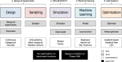

Overview
========

Introduction
^^^^^^^^^^^^

The use of state-of-the-art machine learning tools for innovative structural and materials design has demonstrated their potential in various studies. 
Although the specific applications may differ, the data-driven modelling and optimization process remains the same. 
Therefore, the framework for data-driven design and analysis of structures and materials (:code:`f3dasm`) is an attempt to develop a systematic approach of inverting the material design process. 

The framework, originally proposed by Bessa et al. :cite:p:`Bessa2017` integrates the following fields:

- **Design \& Sampling**, in which input variables describing the microstructure, structure, properties and external conditions of the system to be evaluated are determined and sampled.
- **Simulation**, typically through computational analysis, resulting in the creation of a material response database.
- **Machine learning**, in which a surrogate model is trained to fit experimental findings.
- **Optimization**, where we try to iteratively improve the model to obtain a superior design.

The effectiveness of the first published version of :code:`f3dasm` framework has been demonstrated in various computational mechanics and materials studies, 
such as the design of a super-compressible meta-material :cite:p:`Bessa2019` and a spiderweb nano-mechanical resonator inspired 
by nature and guided by machine learning :cite:p:`Shin2022`. 

Abstraction
^^^^^^^^^^^

By abstracting away the details of specific implementations, users and developers can better organize and reuse their code, 
making it easier to understand, modify, and share with others. Within the :code:`f3dasm` framework, abstraction is done in four levels:

- **block**: blocks represent one of the high-level stages that can be used in the framework, e.g. the :mod:`~f3dasm.optimization` submodule. They can be put in any specific order, and incorporate a core action undertaken by the design.
- **base**: bases represent an abstract class of an element in the block, e.g. the :class:`~f3dasm.optimization.optimizer.Optimizer` class. Base classes are used to create a unified interface for specific implementations and are inherited from blocks.
- **implementation**: implementations are application of a base class feature, e.g. the :class:`~f3dasm.optimization.adam.Adam` optimizer. These can be self-coded or ported from other Python libraries.
- **experiment**: experiments represent executable programs that uses a certain order of blocks and specific implementations to generate results.

Overview of classes
-------------------

================= =============================== ========================================================================== =======================================================
Block             Submodule                       Base                                                                       Implementations
================= =============================== ========================================================================== =======================================================
Design            :mod:`~f3dasm.design`           :class:`~f3dasm.design.design.DesignSpace`                                 
                  :mod:`~f3dasm.sampling`         :class:`~f3dasm.sampling.sampler.Sampler`                                  :ref:`List of samplers <implemented samplers>`
Simulation        :mod:`~f3dasm.simulation`       :class:`~f3dasm.simulation.simulator.Simulator`                            :ref:`List of simulators <implemented simulators>`
Machine learning  :mod:`~f3dasm.machinelearning`  :class:`~f3dasm.machinelearning.model.Model`                               :ref:`List of models <implemented models>`
                  :mod:`~f3dasm.data`             :class:`~f3dasm.data.learningdata.LearningData`                            :ref:`List of learning data <implemented learningdata>`
Optimization      :mod:`~f3dasm.optimization`     :class:`~f3dasm.optimization.optimizer.Optimizer`                          :ref:`List of optimizers <implemented optimizers>`
================= =============================== ========================================================================== =======================================================

.. bibliography::