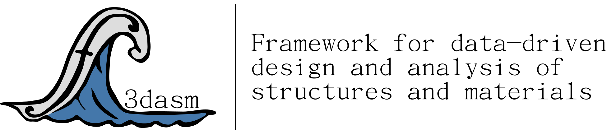

|

Summary
-------
**f3dasm** introduces a general and user-friendly data-driven Python package for researchers and practitioners working on design and analysis of materials and structures.

.. image:: ./img/data-driven-process.png
    :align: center
    :width: 100%

----

Getting started
---------------
The best way to get started is to:

* Read the :ref:`overview` section, containing a brief introduction to the framework and a statement of need.
* Follow the :ref:`installation-instructions` to get going!
* Check out the :ref:`examples` section, containing a collection of examples to get you familiar with the framework.

----

Authorship & Citation
---------------------
:mod:`f3dasm` is created and maintained by Martin van der Schelling [1]_.

.. [1] PhD Candiate, Delft University of Technology, `Website <https://mpvanderschelling.github.io/>`_ , `GitHub <https://github.com/mpvanderschelling/>`_

----

Contribute
----------
:mod:`f3dasm` is an open-source project, and contributions of any kind are welcome and appreciated. If you want to contribute, please go to the `GitHub wiki page <https://github.com/bessagroup/f3dasm/wiki>`_.

----

Useful links
------------
* `GitHub repository <https://github.com/bessagroup/F3DASM/tree/main>`_ (source code)
* `Wiki for development <https://github.com/bessagroup/F3DASM/wiki>`_
* `PyPI package <https://pypi.org/project/f3dasm/>`_ (distribution package)

Related extension libraries
---------------------------
* `f3dasm_optimize <https://github.com/bessagroup/f3dasm_optimize>`_: Optimization algorithms for the :mod:`f3dasm` package.

----

License
-------
Copyright 2024, Martin van der Schelling

All rights reserved.

:mod:`f3dasm` is a free and open-source software published under a :doc:`BSD 3-Clause License <./license>`.
