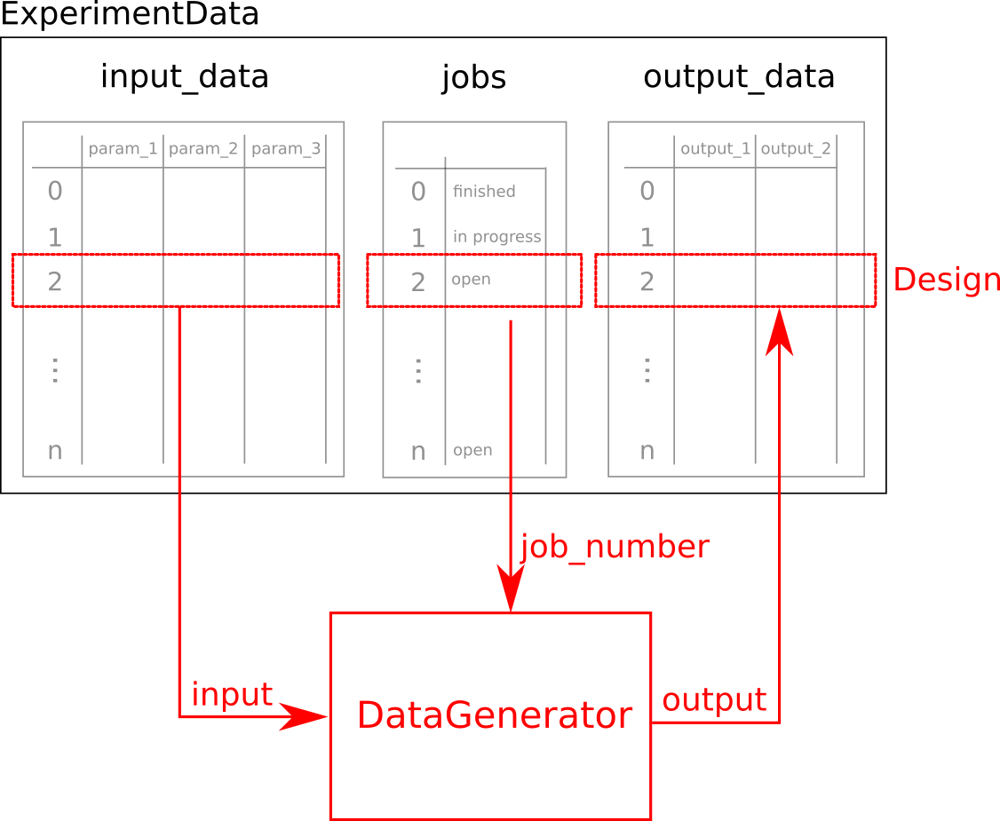

Datagenerator
=============

The :class:`~f3dasm.datageneration.datagenerator.DataGenerator` class is the main class of the :mod:`~f3dasm.datageneration` module.
It is used to generate :attr:`~f3dasm.design.experimentdata.ExperimentData.output_data` for the :class:`~f3dasm.design.experimentdata.ExperimentData` by taking a :class:`~f3dasm.design.design.Design` object.

The :class:`~f3dasm.datageneration.datagenerator.DataGenerator` can serve as the interface between the 
:class:`~f3dasm.design.experimentdata.ExperimentData` object and any third-party simulation software.

|

Creating a data-generator
-------------------------

In order to run your simulator on each of the :class:`~f3dasm.design.design.Design` of your :class:`~f3dasm.design.experimentdata.ExperimentData`, you follow these steps:
In this case, we are utilizing a one of the :ref:`benchmark-functions` to mock a simulator.

1. Construct the :class:`~f3dasm.datageneration.datagenerator.DataGenerator` object.

    .. code-block:: python

        from f3dasm.datageneration.functions import Ackley
        datagenerator = Ackley()

2. Call the :meth:`~f3dasm.design.experimentdata.ExperimentData.run` function with the :class:`~f3dasm.datageneration.datagenerator.DataGenerator` object's :meth:`~f3dasm.datageneration.datagenerator.DataGenerator.run` method as an argument.

    .. code-block:: python

        experimentdata.run(datagenerator.run, method='sequential', kwargs={'some_kwarg': 1})

.. note::

    Any key-word arguments that need to be passed down to the :class:`~f3dasm.datageneration.datagenerator.DataGenerator` :code:`__call__` function can be passed in the :code:`kwargs` argument of the :meth:`~f3dasm.design.experimentdata.ExperimentData.run` function.

There are three methods available of handeling the :class:`~f3dasm.design.design.Design` objects:

* :code:`sequential`: regular for-loop over each of the :class:`~f3dasm.design.design.Design` objects in order
* :code:`parallel`: utilizing the multiprocessing capabilities, each :class:`~f3dasm.design.design.Design` object is run in a separate core
* :code:`cluster`: utilizing the multiprocessing capabilities, each :class:`~f3dasm.design.design.Design` object is run in a separate node. After termination of a design, the node will automatically pick the next available design. More information on this mode can be found in the :ref:`cluster-mode` section.

Implemented data-generators
---------------------------

For a list of all the benchmark functions that are implemented, see :ref:`benchmark-functions`.

======================== ========================================================================= ===============================================================================================
Name                      Docs of the Python class                                                 Reference
======================== ========================================================================= ===============================================================================================
Example                  :code:`example`                                                            `scipy.minimize CG <https://docs.scipy.org/doc/scipy/reference/optimize.minimize-cg.html>`_
======================== ========================================================================= ===============================================================================================

Extend the simulator capabilities
^^^^^^^^^^^^^^^^^^^^^^^^^^^^^^^^^

The :mod:`f3dasm.datageneration` module is designed to be easily extended by third-party libraries.
In order to not bloat the main :mod:`f3dasm` package, these extensions are provided as separate package: `f3dasm_simulate <https://github.com/bessagroup/f3dasm_simulate>`_.

More information can be found in the :ref:`f3dasm-simulate` section.

.. _data-generation-function:

Create your own data-generator
------------------------------

In order to use your own simulator or script, you need to comply with either one of the following options:

* Create a class that inherits from the :class:`~f3dasm.datageneration.datagenerator.DataGenerator` class and implement the methods.
* Create a function that takes a :class:`~f3dasm.design.design.Design` object as an argument (and returns a :class:`~f3dasm.design.design.Design`).

Inherit from DataGenerator
^^^^^^^^^^^^^^^^^^^^^^^^^^

The datagenerator protocol class has three main methods:

* :meth:`~f3dasm.datageneration.datagenerator.DataGenerator.pre_process` - Any preprocessing done before the simulation, optional. Returns None
* :meth:`~f3dasm.datageneration.datagenerator.DataGenerator.execute` - The main functon call to run the simulation. Returns None.
* :meth:`~f3dasm.datageneration.datagenerator.DataGenerator.post_process` - Any post-processing done after the simulation, optional. Returns None

.. note::

    The :meth:`~f3dasm.datagenerationr.datagenerator.DataGenerator.__call__` method chains these three methods together.

In order to create your own data-generator, you need to 

1. inherit from the :class:`~f3dasm.datageneration.datagenerator.DataGenerator` class 
2. implement at least the :meth:`~f3dasm.datageneration.datagenerator.DataGenerator.execute` method

The :meth:`~f3dasm.datageneration.datagenerator.DataGenerator.execute` method should have the following signature:

.. code-block:: python

    def execute(self, design: f3dasm.Design, **kwargs) -> f3dasm.Design:
        # do something with the design
        return design

Create a data-generator from a functional approach
^^^^^^^^^^^^^^^^^^^^^^^^^^^^^^^^^^^^^^^^^^^^^^^^^^

The functional approach is a bit more flexible, as it allows you to use any function 
that takes a :class:`~f3dasm.design.design.Design` object as an argument, and returns a :class:`~f3dasm.design.design.Design` object.

.. note::

    The :class:`~f3dasm.datageneration.datagenerator.DataGenerator` class is a wrapper around the functional approach.

.. code-block:: python
    from f3dasm import Design

    def my_function(design: f3dasm.Design, some_kwarg: int):
        # do something with the design
        return design

    experimentdata.run(my_function, method='sequential', kwargs={'some_kwarg': 1})