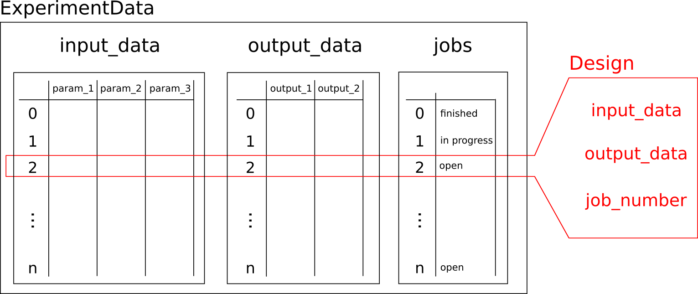

Experiment Sample
=================

A :class:`~f3dasm.design.ExperimentSample` object contains a single realization of the design-of-experiment in :class:`~f3dasm.design.ExperimentData`.

|

.. warning:: 
    A :class:`~f3dasm.design.ExperimentSample` is not constructed manually, but created inside the :class:`~f3dasm.design.ExperimentData` when it is required by internal processes. 
    The main use of the :class:`~f3dasm.design.ExperimentSample` is in the context of the :class:`~f3dasm.datageneration.DataGenerator` in order to extract design variables and store output variables. 
    Learn more about the :class:~`f3dasm.datageneration.DataGenerator` in the :ref:`Data Generation <data-generation>` section.

For each of the experiments in the :class:`~f3dasm.design.ExperimentData`, an :class:`~f3dasm.design.ExperimentSample` object can be created.
This object contains:

* the input parameters of the sample: :attr:`~f3dasm.design.ExperimentSample.input_data`

.. code-block:: python

    >>> experiment_sample.input_data
    {'param_1': 0.0249, 'param_2': 0.034, 'param_3': 0.1}

* the output parameters of the sample: :attr:`~f3dasm.design.ExperimentSample.output_data`

.. code-block:: python

    >>> experiment_sample.output_data
    {'output_1': 0.123, 'output_2': [0.123, 0.456, 0.789], 'output_3': 'Hello world'}

.. note::

    If you have `stored your output to disk <store-to-disk>`, the :attr:`~f3dasm.design.ExperimentSample.output_data` will contain a reference to the stored output instead of the actual output.
    If you want to load the objects from disk, use the :attr:`~f3dasm.design.ExperimentSample.output_data_loaded` attribute.

* the index number of the experiment: :attr:`~f3dasm.design.ExperimentSample.job_number`

.. code-block:: python

    >>> experiment_sample.job_number
    0

Input parameters of an experiment sample can be accessed using the :attr:`~f3dasm.design.ExperimentSample.get` attribute, with the name of the parameter as the key.
An KeyError will be raised if the key is not found.

.. code-block:: python

    >>> experiment_sample.get('param_1')
    0.0249

Storing output parameters to the experiment sample
--------------------------------------------------

After running your simulation, you can store the result back into the :class:`~f3dasm.design.ExperimentSample` with the :meth:`f3dasm.design.ExperimentSample.store` method.
There are two ways of storing your output:

* Singular values can be stored directly to the :attr:`~f3dasm.design.ExperimentData.output_data`
* Large objects can be stored to disk and a reference path will be stored to the :attr:`~f3dasm.design.ExperimentData.output_data`.

Single values
^^^^^^^^^^^^^

Single values or small lists can be stored to the :class:`~f3dasm.design.ExperimentData` using the ``to_disk=False`` argument, with the name of the parameter as the key. 
This will create a new output parameter if the parameter name is not found in :attr:`~f3dasm.design.ExperimentData.output_data` of the :class:`~f3dasm.design.ExperimentData` object:
This is especially useful if you want to get a quick overview of some loss or design metric of your sample. 

.. code-block:: python

    >>> experiment_sample.store('output_1', 0.123, to_disk=False)
    >>> experiment_sample('output_2', 'Hello world', to_disk=False)

All built-in singular types are supported for storing to the :class:`~f3dasm.design.ExperimentData` this way. Array-like data such as numpy arrays and pandas dataframes are **not** supported and will raise an error.

.. note:: 
    Outputs stored directly to the :attr:`~f3dasm.design.ExperimentData.output_data` will be stored within the :class:`~f3dasm.design.ExperimentData` object.
    This means that the output will be loaded into memory everytime this object is accessed. For large outputs, it is recommended to store the output to disk. 

.. _store-to-disk:

Large objects and array-like data
^^^^^^^^^^^^^^^^^^^^^^^^^^^^^^^^^

In order to store large objects or array-like data, the :meth:`~f3dasm.design.ExperimentSample.store` method using the ``to_disk=True`` argument, can be used. 
A reference (:code:`Path`) will be saved to the :attr:`~f3dasm.design.ExperimentData.output_data`.

.. code-block:: python

    >>> output = np.array(...) # your output data
    >>> experiment_sample.store('output_numpy', output, to_disk=True)

:mod:`f3dasm` will automatically create a new directory for each output parameter and store the object with a generated filename referencing the :attr:`~f3dasm.design.ExperimentSample.job_number` of the design.

.. code-block:: none
   :caption: Directory Structure

   my_project/
   ├── output_numpy/
   │   ├── 0.npy
   │   ├── 1.npy
   │   ├── 2.npy
   │   └── 3.npy
   ├── my_experiment_domain.pkl
   ├── my_experiment_data.csv
   ├── my_experiment_output.csv
   └── my_experiment_jobs.pkl

In the :attr:`~f3dasm.design.ExperimentData.output_data`, a reference to the stored object (e.g. :code:`my_project/output_1/0.npy`) will be automatically appended to the `path_<output parameter name>` parameter.

.. code-block:: python

    >>> experiment_sample['output_numpy']
    'my_project/output_numpy/0.npy'

:mod:`f3dasm` has built-in storing functions for numpy :class:`~numpy.ndarray`, pandas :class:`~pandas.DataFrame` and xarray :class:`~xarray.DataArray` and :class:`~xarray.Dataset`. 
For any other type of object, the object will be stored in the `pickle <https://docs.python.org/3/library/pickle.html>`_ format

You can provide your own storing class to the :class:`~f3dasm.design.ExperimentSample.store` method call:

* a ``store`` method should store an ``self.object`` to disk at the location of ``self.path``
* a ``load`` method should load the object from disk at the location of ``self.path`` and return it
* a class variable ``suffix`` should be defined, which is the file extension of the stored object as a string.
* the class should inherit from the :class:`~f3dasm.design._Store` class

You can take the following class for a :class:`~numpy.ndarray` object as an example:

.. code-block:: python

    class NumpyStore(_Store):
        suffix: int = '.npy'

        def store(self) -> None:
            np.save(file=self.path.with_suffix(self.suffix), arr=self.object)

        def load(self) -> np.ndarray:
            return np.load(file=self.path.with_suffix(self.suffix))

After defining the storing function, it can be used as an additional argument in the :meth:`~f3dasm.design.ExperimentSample.store` method:

.. code-block:: python

    >>> experiment_sample.store('output_1', my_custom_large_object, numpy_storing_function)

Loading output parameters that are referenced
^^^^^^^^^^^^^^^^^^^^^^^^^^^^^^^^^^^^^^^^^^^^^

When loading an output parameter that is referenced, the :class:`~f3dasm.design.ExperimentSample` will automatically load the object from disk and return it
when you are calling the :attr:`~f3dasm.design.ExperimentSample.get` method.

.. note::

    If you are using a custom storing object, you need to provide the object as an additional argument to the :attr:`~f3dasm.design.ExperimentSample.get` method.
    everytime you are loading the object.

.. code-block:: python

    >>> experiment_sample.get('output_numpy')
    np.array(...)

Exporting to other datatypes
----------------------------

The :class:`~f3dasm.design.ExperimentSample` can be exported to a tuple of numpy :class:`~numpy.ndarray` from the ``input_data`` and ``output_data`` respectively using the :meth:`~f3dasm.design.ExperimentSample.to_numpy` method:

.. code-block:: python

    >>> experiment_sample.to_numpy()
    np.array([0.0249, 0.123, 0.456, 0.789]), np.array([0.003])

The :class:`~f3dasm.design.ExperimentSample` can be exported to a dictionary :class:`~pandas.DataFrame` using the :meth:`~f3dasm.design.ExperimentSample.to_dict` method:

.. code-block:: python

    >>> experiment_sample.to_dict()
    {'input_1': 0.0249, 'input_2': 0.123, 'input_3': 0.456, 'input_4': 0.789, 'output_data': -0.003, 'job_number': 0}

.. note::

    The :meth:`~f3dasm.design.ExperimentSample.to_dict` method will return a dictionary including the :attr:`~f3dasm.design.ExperimentSample.job_number` as the key.
    Additionally, the ``output_data`` will also be loaded from disk if applicable.