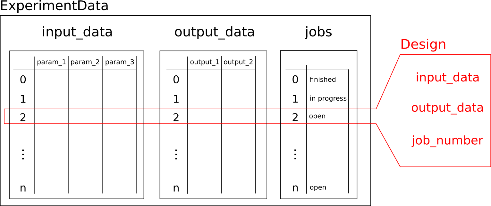

Experment Sample
================

A :class:`~f3dasm.design.ExperimentSample` object contains a single realization of the design-of-experiment in :class:`~f3dasm.design.ExperimentData`.

|

.. note:: 
    A :class:`~f3dasm.design.ExperimentSample` is not constructed manually, but created inside the :class:`~f3dasm.design.ExperimentData` when it is required by internal processes. 
    The main use of the :class:`~f3dasm.design.ExperimentSample` is to pass it to your own functions and scripts to extract design variables and store output variables.

For each of the experiments in the :class:`~f3dasm.design.ExperimentData`, a :class:`~f3dasm.design.ExperimentSample` object can be created.
This object contains the input and output parameters of a single realization of the :class:`~f3dasm.design.ExperimentData`, as well as the index number of the experiment (:attr:`~f3dasm.design.ExperimentSample.job_number`).

.. code-block:: python
    
   from f3dasm import ExperimentSample

    def my_function(experiment_sample: ExperimentSample, **kwargs):
        parameter1 = experiment_sample['param_1']
        parameter2 = experiment_sample['param_2']
        job_number = experiment_sample.job_number
        ...  # Your own program

        experiment_sample['output_1'] = output
        return experiment_sample

A function with a signature like :code:`my_function` can be used as a callable in the :meth:`~f3dasm.design.ExperimentData.run` method to iterate over every sample in the :class:`~f3dasm.design.ExperimentData`.

.. note:: 
    In order to use :code:`my_function` within :mod:`f3dasm` workflow, the first argument needs to be a :class:`~f3dasm.design.ExperimentSample` object. 
    The function can have any number of additional arguments, which will be passed to the function when it is called.
    Lastly, the :class:`~f3dasm.design.ExperimentSample` must be returned.

Extract parameters from a experiment sample
-------------------------------------------

Input parameters of an experiment sample can be accessed using the :meth:`~f3dasm.ExperimentSample.get` operator, with the name of the parameter as the key.

.. code-block:: python

    >>> experiment_sampleget('param_1')
    0.0249

The job_number of the experiment sample can be accessed using the :attr:`~f3dasm.design.ExperimentSaple.job_number` attribute and is zero-indexed.

.. code-block:: python

    >>> experiment_sample.job_number
    0

The input and output parameters of an experiment sample can be extracted as a tuple of numpy arrays with the :meth:`~f3dasm.ExperimentSample.to_numpy` method.

.. code-block:: python

    >>> experiment_sample.to_numpy()
    (np.array([0.0249, 0.034, 0.100]), np.array([]))

Storing output parameters to the experiment sample
--------------------------------------------------

After running your calculation, you can store the result back into the experiment sample with the :meth:`f3dasm.design.ExperimentSample.store` method.
This can be done in two ways

* Singular values and small lists can be stored directly to the :attr:`~f3dasm.design.ExperimentData.output_data`: ``on_disk=False``.
* Large objects can be stored to disk with the :meth:`f3dasm.design.ExperimentSample.store` method: ``on_disk=True``.

Single values or small lists
^^^^^^^^^^^^^^^^^^^^^^^^^^^^

Single values or small lists can be stored to the :class:`~f3dasm.design.ExperimentData` directly, with the name of the parameter as the key. 
This will create a new output parameter if the parameter name is not found in :attr:`~f3dasm.design.ExperimentData.output_data` of the :class:`~f3dasm.design.ExperimentData`.

.. code-block:: python

    >>> experiment_sample.store(object=0.123, name='output_1', to_disk=False)
    >>> experiment_sample[.store(object=[0.123, 0.456, 0.789], name='output_2', to_disk=False)
    >>> experiment_sample.store(object='Hello world', name='output_3', to_disk=False)

All built-in types are supported for storing to the :class:`~f3dasm.design.ExperimentData` this way. Array-like data such as numpy arrays and pandas dataframes are **not** supported and will raise an error.

.. note:: 
    Outputs stored directly to the :attr:`~f3dasm.design.ExperimentData.output_data` will be stored within the :class:`~f3dasm.design.ExperimentData` object.
    This means that the output will be loaded into memory everytime this object is accessed. For large outputs, it is recommended to store the output to disk. 

Large objects and array-like data
^^^^^^^^^^^^^^^^^^^^^^^^^^^^^^^^^

In order to store large objects or array-like data, the the argument ``on_disk=True`` method can be used. A reference (:code:`Path`) will be saved to the :attr:`~f3dasm.design.ExperimentData.output_data`.

.. code-block:: python

    >>> experiment_sample.store(object=my_larg_object, name='output_1', to_disk=True)

:mod:`f3dasm` will automatically create a new directory for each output parameter and store the object with a generated filename referencing the :attr:`~f3dasm.design.ExperimentSample.job_number` of the design.

.. code-block:: none
   :caption: Directory Structure

   my_project/
   ├── output_1/
   │   ├── 0.npy
   │   ├── 1.npy
   │   ├── 2.npy
   │   └── 3.npy
   ├── my_experiment_domain.pkl
   ├── my_experiment_data.csv
   ├── my_experiment_output.csv
   └── my_experiment_jobs.pkl

In the :attr:`~f3dasm.design.ExperimentData.output_data`, a reference to the stored object (e.g. :code:`my_project/output_1/0.npy`) will be automatically appended to the `<output parameter name>_path` parameter.
When the reference to the stored object is accessed, the object will be automatically loaded from disk.

Custom storage classes
^^^^^^^^^^^^^^^^^^^^^^

:mod:`f3dasm` has built-in storing functions for numpy arrays, pandas DataFrames and xarray DataArrays and Datasets.
For any other type of object, you can provide a storing class to the :meth:`~f3dasm.design.ExperimentSample.store` method call:

* The class must inherit from :class:`~f3dasm.design._Store`. class
* The class variable ``suffix`` must be defined. This is the file extension of the stored object.
* The ``store(self)`` method must be defined. This method will be called when the object is stored to disk.
* The ``load(self)`` method must be defined. This method will be called when the object is loaded from disk.

The object attributes ``self.path`` and ``self.object`` can be used to access the path to the stored object and the object itself.

You can take the following function as an example:

.. code-block:: python

    class NumpyStore(_Store):
        suffix: int = '.npy'

        def store(self) -> None:
            np.save(file=self.path.with_suffix(self.suffix), arr=self.object)

        def load(self) -> np.ndarray:
            return np.load(file=self.path.with_suffix(self.suffix))

After defining the storing class, it can be used as an argument in the :meth:`~f3dasm.design.ExperimentSample.store` method:

.. code-block:: python

    >>> experiment_sample.store('output_1', my_large_object, numpy_storing_function)