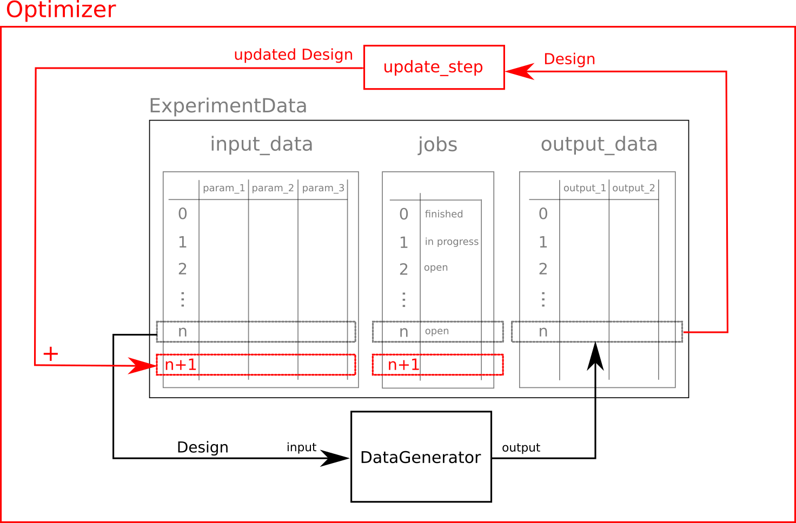

Optimizer
=========

The :class:`~f3dasm.optimization.Optimizer` class is used to find the minimum of a particular quantity of interest through an iterative fashion.

* The :meth:`~f3dasm.optimization.Optimizer.update_step` method takes a :class:`~f3dasm.datageneration.functions.function.Function` object and outputs a tuple containing the position and evaluated value of the next iteration.
* The :meth:`~f3dasm.optimization.Optimizer.iterate` method is used to start the optimization process. It takes the number of iterations and a :class:`~f3dasm.base.function.Function` object as arguments. For every iteration, the :meth:`~f3dasm.optimization.Optimizer.update_step` method is called and the results are stored as new :class:`~f3dasm.design.experimentsample.ExperimentSample` in the :class:`~f3dasm.design.ExperimentData` object.

|

Create an optimizer
-------------------

First, we have to determine the suitable search-space by creating a :class:`~f3dasm.design.Domain` object.

.. code-block:: python

    from f3dasm import Domain, ContinuousParameter

    domain = Domain(input_space={'x0': ContinuousParameter(lower_bound=0.0, upper_bound=1.0), 
                                    'x1': ContinuousParameter(lower_bound=0.0, upper_bound=1.0)})

Next, we have to create initial samples. We can use the :class:`~f3dasm.sampling.latinhypercube.LatinHypercube` class to create samples:

.. code-block:: python

    from f3dasm.sampling import LatinHypercube

    sampler_lhs = LatinHypercube(domain)
    samples = sampler_lhs.get_samples(10)

We will use the :class:`~f3dasm.optimization.lbfgsb.LBFGSB` optimizer to find the minimum. We can find an implementation in the :mod:`f3dasm.optimization` module:

.. code-block:: python

    from f3dasm.optimization import LBFGSB

    optimizer = LBFGSB(samples)

By calling the :meth:`~f3dasm.optimization.Optimizer.iterate` method and specifying the : and the number of iterations, we will start the optimization process:

.. code-block:: python
    
    from f3dasm.datageneration.functions import Ackley

    f = Ackley()
    optimizer.iterate(iterations=100, function=f)

After that, we can extract the :class:`~f3dasm.design.ExperimentData` object from the optimizer:

.. code-block:: python

    lbfgsb_data = optimizer.extract_data()

.. _implemented optimizers:

Implemented optimizers
----------------------

The following implementations of optimizers can found under the :mod:`f3dasm.optimization` module: 
These are ported from `scipy-optimize <https://docs.scipy.org/doc/scipy/reference/optimize.html>`_

======================== ========================================================================= ===============================================================================================
Name                      Docs of the Python class                                                 Reference
======================== ========================================================================= ===============================================================================================
CG                       :class:`~f3dasm.optimization.CG`                                          `scipy.minimize CG <https://docs.scipy.org/doc/scipy/reference/optimize.minimize-cg.html>`_
LBFGSB                   :class:`~f3dasm.optimization.LBFGSB`                                      `scipy.minimize L-BFGS-B <https://docs.scipy.org/doc/scipy/reference/optimize.minimize-lbfgsb.html>`_
NelderMead               :class:`~f3dasm.optimization.NelderMead`                                  `scipy.minimize NelderMead <https://docs.scipy.org/doc/scipy/reference/optimize.minimize-neldermead.html>`_
RandomSearch             :class:`~f3dasm.optimization.RandomSearch`                                `numpy <https://numpy.org/doc/>`_
======================== ========================================================================= ===============================================================================================

Extend the optimization capabilities
^^^^^^^^^^^^^^^^^^^^^^^^^^^^^^^^^^^^

The :mod:`f3dasm.optimization` module is designed to be easily extended by third-party libraries.
More optimization algorithms are available in the `f3dasm_optimize <https://github.com/bessagroup/f3dasm_optimize>`_ package, which can be installed via pip:

.. code-block:: bash

    pip install f3dasm_optimize

More information about this extension can be found in the `f3dasm_optimize Documentation <https://bessagroup.github.io/f3dasm_optimize/>`_

Create your own optimizer
----------------------------

First, we create a class storing the potential hyper-parameters for our optimizers. Even if we our optimizer doesn't have hyper-parameters, you still have to create this class

This class has to be inhereted from the :class:`~f3dasm.optimization.OptimizerParameters` class. This inhereted class consists two mandatory attributes: 

* :attr:`~f3dasm.optimization.OptimizerParameters.population`: how many points are created for each update step. Defaults to 1
* :attr:`~f3dasm.optimization.OptimizerParameters.force_bounds`: if the optimizer is forced to stay between the domain bounds. Defaults to True. Currently does not work when set to False!

.. code-block:: python

    @dataclass
    class NewOptimizer_Parameters(f3dasm.OptimizerParameters):
    """Example of hyperparameters"""

    example_hyperparameter_1: float = 0.999
    example_hyperparameter_2: bool = True

Next, we create an new optimizer by inheriting from the :class:`~f3dasm.optimization.Optimizer` class

* We create a class attribute :attr:`~f3dasm.optimization.Optimizer.parameter` and initialize it without any arguments in order to use the defaults specified above
* The only function we have to implement is the :func:`~f3dasm.optimization.Optimizer.update_step` function, which takes a :class:`~f3dasm.Function` and outputs a tuple containing the position and evaluated value of the next iteration
* The :func:`~f3dasm.optimization.Optimizer.init_parameters` function is optional. It can be used to store dynamic hyper-parameters that update throughout updating

.. code-block:: python

    class NewOptimizer(f3dasm.Optimizer):
    """Example of implement your own optimizer"""

    parameter: NewOptimizer_Parameters = NewOptimizer_Parameters()

    def init_parameters(self):
        """Set the dynamic initialization parameters. These are resetted every time the iterate method is called."""
        pass

    def update_step(self, function: f3dasm.Function) -> Tuple[np.ndarray, np.ndarray]:
        """Custom update step for your own optimizer

        Parameters
        ----------
        function
            objective function that is being optimized

        Returns
        -------
            tuple of resulting input and output parameter
        """
        return x, y

In order to use the optimizer, we call the :func:`~f3dasm.optimization.Optimizer.iterate` method, which for-loops over the :func:`~f3dasm.optimization.Optimizer.update_step` method, appending the :code:`x` and :code:`y` values to the internal :attr:`~f3dasm.optimization.Optimizer.data` attribute.

