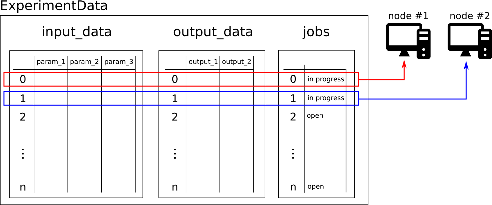
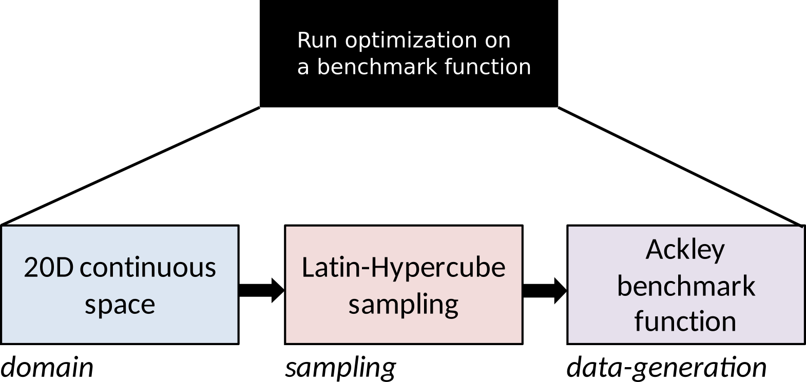

High-performance computing cluster
==================================

Your :mod:`f3dasm` workflow can be seemlessly translated to a high-performance computing cluster.
The advantage is that you can parallelize the total number of experiments among the nodes of the cluster.
This is especially useful when you have a large number of experiments to run.

.. note::
    :code:`mode=cluster` and :code:`mode=parallel` simultaneous on the :meth:`~f3dasm.ExperimentData.evaluate` function cannot be used.
    In the case of extended paralellization on cores, you have to implement this in your own scripts!.

Working with array-jobs
-----------------------

Suppose you have to run a Python script on a high-performance computing cluster. This is normally done by submitting a bash-script denoting the job-details to the cluster.
This bash-script will have a line executing the Python script from a command line interface:

.. code-block:: bash

    python main.py

High-performance computing clusters could have the ability to submit an array of jobs, i.e. sending out the same job to multiple nodes, can be used to parallelize the total number of experiments across nodes.
When submitting an array-job, each job has a unique identifier.

We can use this unique identifier as a flag to the command line call:

.. tabs::

    .. group-tab:: TORQUE

        .. code-block:: bash

            python main.py --jobid=${PBS_ARRAYID}

    .. group-tab:: SLURM

        .. code-block:: bash

            python main.py --jobid=${SLURM_ARRAY_TASK_ID}

After you have imported :mod:`f3dasm`
You can use the global variable :code:`f3dasm.HPC_JOBID` to get the array-job identifier and use it in your scripts.

.. code-block:: python
    :caption: main.py

    import f3dasm
    print(f3dasm.HPC_JOBID)
    >>> 0

.. note::
    If the :code:`f3dasm.HPC_JOBID` is not set, it will return the value :code:`None`

.. _cluster-mode:

Using the cluster mode on ExperimentData
----------------------------------------

The :meth:`~f3dasm.ExperimentData.evaluate` method of the :class:`~f3dasm.ExperimentData` class has a parameter :code:`mode` that can be set to :code:`cluster`.
What this does is that for all the methods that alter the data of the :class:`~f3dasm.ExperimentData`, the :class:`~f3dasm.ExperimentData` object will be retrieved from disk and after each operation be written to the disk again.
During the operation, no other process can access the data of the :class:`~f3dasm.ExperimentData` object, as the file will be locked.

.. note::
    You will notice that a :code:`.lock` file will be created in the directory of the :class:`~f3dasm.ExperimentData` object. This file will disable concurent access to the data.

The cluster mode enables you to use multiple nodes to each retrieve an open :class:`~f3dasm.ExperimentSample` from the :class:`~f3dasm.ExperimentData`, execute the data generation function, and write the data back to the disk.
Whenever a node is working executing a particular design, the job-value will be set to 'in progress', making sure that other processes are not repeating that experiment.

|

Example
-------

The following example is the same as in section :ref:`workflow`; only now we are omiting the optimization part and only parallelize the data generation:

* Create a 20D continuous :class:`~f3dasm.design.Domain`
* Sample from the domain using a the Latin-hypercube sampler
* With multiple nodes; use a data generation function, which will be the ``"Ackley"`` function a from the :ref:`benchmark-functions`

|

We want to make sure that the sampling is done only once, and that the data generation is done in parallel.
Therefore we can divide the different nodes into two categories:

* The first node (:code:`f3dasm.HPC_JOBID == 0`) will be the **master** node, which will be responsible for creating the design-of-experiments and sampling
* All the other nodes (:code:`f3dasm.HPC_JOBID > 0`) will be **process** nodes, which will retrieve the :class:`~f3dasm.ExperimentData` from disk and go straight to the data generation function.

.. image:: ../../../img/f3dasm-workflow-cluster-roles.png
   :width: 100%
   :align: center
   :alt: Cluster roles

|

.. note::
    This example has been tested with the `hpc06 cluster of Delft University of Technology <https://hpcwiki.tudelft.nl/index.php/Main_Page>`_.
    This is a cluster that uses the `TORQUE resource manager <https://en.wikipedia.org/wiki/TORQUE>`_.

Directory Structure
^^^^^^^^^^^^^^^^^^^

The directory structure for the project is as follows:

- `my_project/` is the root directory.
- `my_script.py` contains the user-defined script. In this case a custom data-generationr function `my_function`.
- `pbsjob.sh` is the bash script that will be submitted to the HPC.
- `main.py` is the main entry point of the project, governed by :mod:`f3dasm`.

.. code-block:: none
   :caption: Directory Structure

   my_project/
   ├── my_script.py
   ├── pbsjob.sh   
   └── main.py

my_script.py
^^^^^^^^^^^^

The user-defined script is identical to the one in :ref:`my-script`. Only now we are omiting the optimization part and only parallelize the data generation.

pbsjob.sh
^^^^^^^^^

.. tabs::

    .. group-tab:: TORQUE

        .. code-block:: bash

            #!/bin/bash
            # Torque directives (#PBS) must always be at the start of a job script!
            #PBS -N ExampleScript
            #PBS -q mse
            #PBS -l nodes=1:ppn=12,walltime=12:00:00

            # Make sure I'm the only one that can read my output
            umask 0077

            # The PBS_JOBID looks like 1234566[0].
            # With the following line, we extract the PBS_ARRAYID, the part in the brackets []:
            PBS_ARRAYID=$(echo "${PBS_JOBID}" | sed 's/\[[^][]*\]//g')

            module load use.own
            module load miniconda3
            cd $PBS_O_WORKDIR

            # Here is where the application is started on the node
            # activating my conda environment:

            source activate f3dasm_env

            # limiting number of threads
            OMP_NUM_THREADS=12
            export OMP_NUM_THREADS=12

            # If the PBS_ARRAYID is not set, set it to None
            if ! [ -n "${PBS_ARRAYID+1}" ]; then
            PBS_ARRAYID=None
            fi

            # Executing my python program with the jobid flag
            python main.py --jobid=${PBS_ARRAYID}

    .. group-tab:: SLURM

        .. code-block:: bash

            #!/bin/bash -l

            #SBATCH -J "ExmpleScript"            		# name of the job (can be change to whichever name you like)
            #SBATCH --get-user-env             			# to set environment variables

            #SBATCH --partition=compute
            #SBATCH --time=12:00:00
            #SBATCH --nodes=1
            #SBATCH --ntasks-per-node=12
            #SBATCH --cpus-per-task=1
            #SBATCH --mem=0
            #SBATCH --account=research-eemcs-me
            #SBATCH --array=0-2

            source activate f3dasm_env

            # Executing my python program with the jobid flag
            python3 main.py --jobid=${SLURM_ARRAY_TASK_ID}

A few things to note:

* Make sure that your main script is called `main.py`
* The script assumes that you are using `conda <https://docs.conda.io/projects/miniconda/en/latest/index.html>`_ to manage your python environment and the environment is called `f3dasm_env`. If you are not, you can remove the lines that activate the conda environment.
* The walltime, nodes and number of cores per node are for **each** of the jobs in the array-job.

main.py
^^^^^^^

The `main.py` file is the main entry point of the project. It contains the :mod:`f3dasm` classes and acts on these interfaces.
It imports :mod:`f3dasm` and the `my_function` from `my_script.py`. 
In the main function, we create the :class:`~f3dasm.design.Domain`, sample from the Latin Hypercube sampler , and executes the data generation function (`my_function`) using the :meth:`~f3dasm.ExperimentData.Experiment.evaluate` method with the specified execution mode.

Additionally, the `main.py` file handles which node takes which role.

.. code-block:: python
   :caption: main.py

    from f3dasm import ExperimentData
    from f3dasm.domain import make_nd_continuous_domain
    from my_script import my_function
    from time import sleep

    def create_experimentdata():
        """Design of Experiment"""
        # Create a domain object
        domain = make_nd_continuous_domain(bounds=np.tile([0.0, 1.0], (20, 1)), dimensionality=20)

        # Create the ExperimentData object
        data = ExperimentData(domain=domain)

        # Sampling from the domain
        data.sample(sampler='latin', n_samples=10)

        # Store the data to disk
        data.store()

    def worker_node():
        # Extract the experimentdata from disk
        data = f3dasm.ExperimentData.from_file(project_dir='.')

        """Data Generation"""
        # Use the data-generator to evaluate the initial samples
        data.evaluate(data_generator='Ackley', mode='cluster')

    if __name__ is '__main__':
        # Check the jobid of the current node
        if f3dasm.HPC_JOBID == 0:
            create_experimentdata()
            worker_node()
        elif f3dasm.HPC_JOBID > 0:
            # Asynchronize the jobs in order to omit racing conditions
            sleep(f3dasm.HPC_JOBID)
            worker_node()

Run the program
^^^^^^^^^^^^^^^

You can run the workflow by submitting the bash script to the HPC queue:

.. tabs::

    .. group-tab:: TORQUE

        .. code-block:: bash

            qsub pbsjob.sh -t 0-2

    .. group-tab:: SLURM

        .. code-block:: bash

            sbatch pbsjob.sh

For the TORQUE system, the :code:`-t 0-2` option submits an array job with 3 jobs with :code:`f3dasm.HPC_JOBID` of 0, 1 and 2.

.. _hydra-on-hpc:

Running hydra on a high-performance computing cluster
-----------------------------------------------------

.. _hydra: https://hydra.cc/

Combining the `hydra`_ and a high-performance computing network requires two small changes
* Adding the :code:`hpc.jobid` keyword to your configuration file
* Setting up concurrent logging

Adding the jobid keyword to your configuration file
^^^^^^^^^^^^^^^^^^^^^^^^^^^^^^^^^^^^^^^^^^^^^^^^^^^

Because the `hydra`_  :code:`config.yaml` file is handling command line flags, you have to add a :code:`hpc` keyword to the configuration file

.. code-block:: yaml
   :caption: config.yaml

   hpc:
        jobid: -1

In your bash script, you have to overwrite this value with the :code:`++hpc.jobid` flag:

.. tabs::

    .. group-tab:: TORQUE

        .. code-block:: bash

            #!/bin/bash
            # Torque directives (#PBS) must always be at the start of a job script!
            #PBS -N ExampleScript
            #PBS -q mse
            #PBS -l nodes=1:ppn=12,walltime=12:00:00

            # Make sure I'm the only one that can read my output
            umask 0077

            # The PBS_JOBID looks like 1234566[0].
            # With the following line, we extract the PBS_ARRAYID, the part in the brackets []:
            PBS_ARRAYID=$(echo "${PBS_JOBID}" | sed 's/\[[^][]*\]//g')

            module load use.own
            module load miniconda3
            cd $PBS_O_WORKDIR

            # Here is where the application is started on the node
            # activating my conda environment:

            source activate f3dasm_env

            # limiting number of threads
            OMP_NUM_THREADS=12
            export OMP_NUM_THREADS=12

            # If the PBS_ARRAYID is not set, set it to None
            if ! [ -n "${PBS_ARRAYID+1}" ]; then
            PBS_ARRAYID=None
            fi

            # Executing my python program with the jobid flag
            python main.py ++hpc.jobid=${PBS_ARRAYID} hydra.run.dir=outputs/${now:%Y-%m-%d}/${JOB_ID}

    .. group-tab:: SLURM

        .. code-block:: bash

            #!/bin/bash -l

            #SBATCH -J "ExmpleScript"            		# name of the job (can be change to whichever name you like)
            #SBATCH --get-user-env             			# to set environment variables

            #SBATCH --partition=compute
            #SBATCH --time=12:00:00
            #SBATCH --nodes=1
            #SBATCH --ntasks-per-node=12
            #SBATCH --cpus-per-task=1
            #SBATCH --mem=0
            #SBATCH --account=research-eemcs-me
            #SBATCH --array=0-2

            source activate f3dasm_env

            # Executing my python program with the jobid flag
            python3 main.py ++hpc.jobid=${SLURM_ARRAY_TASK_ID} hydra.run.dir=outputs/${now:%Y-%m-%d}/${SLURM_ARRAY_JOB_ID}

In your `main.py` file, the :code:`hpc.jobid` keyword is now available from the `config.yaml` file:

.. code-block:: python
   :caption: main.py for hydra and HPC integration

    # Your f3dasm workflow
    ...

    @hydra.main(config_path=".", config_name="config")
    def main(config):    
        # Check the jobid of the current node
        if config.hpc.jobid == 0:
            create_experimentdata()
            worker_node()
        elif config.hpc.jobid > 0:
            # Asynchronize the jobs in order to omit racing conditions
            sleep(config.hpc.jobid)
            worker_node()

Setting up concurrent logging
^^^^^^^^^^^^^^^^^^^^^^^^^^^^^

The `hydra`_ framework sets up the logging module and writes the log files to the :code:`hydra.run.dir` directory.
However, when multiple nodes log to the same file, the file can become corrupted due to concurrent writing.
In order to mitigate this, you have to overwrite the logging to file behaviour of the `hydra`_ framework.

1. Create a `custom.yaml` file and its directories `hydra` and `job_logging` in your project as follows:

.. code-block:: none
   :caption: Directory Structure

   my_project/
   ├── hydra
   |     └─ job_logging
   |           └─ custom.yaml  
   ├── my_script.py
   ├── pbsjob.sh   
   └── main.py

2. Inside the `custom.yaml` file, add the following lines:

.. code-block:: yaml
   :caption: custom.yaml

    # python logging configuration for tasks
    version: 1
    formatters:
    simple:
        format: "[%(asctime)s][%(name)s][%(levelname)s] - %(message)s"
    handlers:
    console:
        class: logging.StreamHandler
        formatter: simple
        stream: ext://sys.stdout
    file:
        class: f3dasm.DistributedFileHandler
        formatter: simple
        # absolute file path
        filename: ${hydra.runtime.output_dir}/${hydra.job.name}.log
    root:
    level: INFO
    handlers: [console, file]

    disable_existing_loggers: false

.. note::

    `hydra`_ is now using the custom :code:`f3dasm.DistributedFileHandler` class to write the log files.

3. At the top of your `config.yaml` configuration file, add the following lines:

.. code-block:: yaml
   :caption: config.yaml

    defaults:
    - override hydra/job_logging: custom
