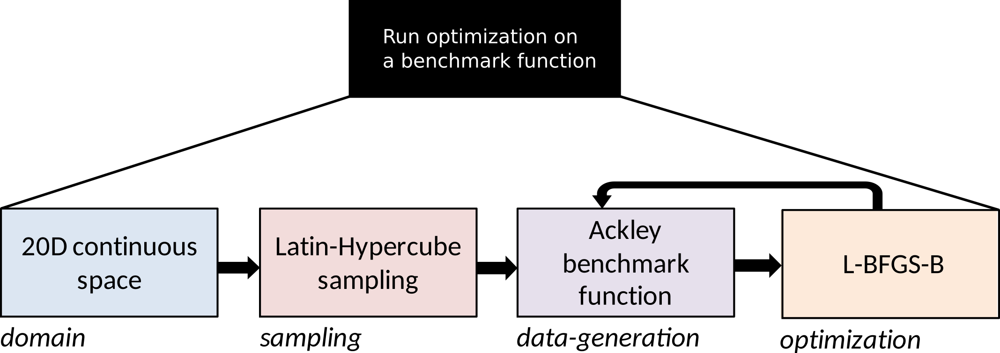

.. _workflow:

Creating a Data-driven process
==============================

All of the :mod:`f3dasm` classes come together in the ``main`` script creating the data-driven process. It serves as the entry-point of your data-driven application.

The worfklow should act on the interfaces of the :mod:`f3dasm` classes and any experiment-specific scripts can be imported into the workflow.
In this way, the workflow itself is independent of the experiment-specific scripts and can be reused for different experiments.

Example with built-ins
----------------------

In the following examples, we will create a workflow for the following data-driven process:

* Create a 20D continuous :class:`~f3dasm.design.domain.Domain`
* Sample from the domain using the built-in Latin-hypercube sampler
* Use a data generation function, which will be the ``"Ackley"`` function a from the :ref:`benchmark-functions`
* Optimize the data generation function using the built-in ``"LBFGSB"`` optimizer.

|

Directory Structure
^^^^^^^^^^^^^^^^^^^

The directory structure for the project is as follows:

- `my_project/` is the root directory.
- `main.py` is the main entry point of the project, governed by :mod:`f3dasm`.

.. code-block:: none
   :caption: Directory Structure

   my_project/
   └──  main.py

.. _my-script:

main.py
^^^^^^^

The `main.py` file is the main entry point of the project. It contains the :mod:`f3dasm` classes and acts on these interfaces.
In the main function, we create the :class:`~f3dasm.design.domain.Domain`, sample from it, evaluate the samples with the data generation function and optimize with the optimizer.

.. code-block:: python
   :caption: main.py

    from f3dasm.design import make_nd_continuous_domain

    """Design of Experiment"""
    # Create a domain object
    domain = make_nd_continuous_domain(bounds=np.tile([0.0, 1.0], (20, 1)), dimensionality=20)

    # Create the ExperimentData object
    data = ExperimentData(domain=domain)

    # Sampling from the domain
    data.sample(sampler='latin', n_samples=10, seed=42)

    """Data Generation"""
    # Use the data-generator to evaluate the initial samples
    data.evaluate(data_generator="ackley", mode='sequential')

    """Optimization"""
    data.optimize(data_generator="ackley", optimizer="lbfgsb", iterations=100)

.. note::
    In the `main.py` file, notice that there is only one connection with the `my_script.py` file, which is the `my_function` function import. 
    This means that the workflow file (`main.py`) is independent of the application file (`my_script.py`) and can be reused for different experiments.

Adding your own sampler
-----------------------

If you want to substitute the built-in sampler ``"latin"`` with your own sampler, you can do so by creating a new file, e.g. `my_script.py` and adding it to the directory structure:

.. code-block:: none
   :caption: Directory Structure

   my_project/
   ├── my_script.py
   └── main.py

Now, we are going to creat a custom sampler in ``my_script`` and import it into the ``main.py`` file.
In the `my_script.py` file, we create a function called ``my_sampler``:

.. code-block:: python
   :caption: my_script.py

    from f3dasm import Domain

    def my_sampler(domain: Domain, n_samples: int, seed: int):
        # Create the samples of the domain in a numpy array or pandas DataFrame format
        ...
        return samples

.. note::
    Learn more about complying to the sampling interface in the :ref:`sampling <sampling>` section.

Now we can import ``my_sampler`` into the ``main.py`` file and use it as a sampler:

.. code-block:: python
   :caption: main.py with custom sampler

    from f3dasm.design import make_nd_continuous_domain
    from my_script import my_sampler

    """Design of Experiment"""
    # Create a domain object
    domain = make_nd_continuous_domain(bounds=np.tile([0.0, 1.0], (20, 1)), dimensionality=20)

    # Create the ExperimentData object
    data = ExperimentData(domain=domain)

    # Sampling from the domain
    data.sample(sampler=my_sampler, n_samples=10, seed=42)

    """Data Generation"""
    # Use the data-generator to evaluate the initial samples
    data.evaluate(data_generator="ackley", mode='sequential')

    """Optimization"""
    data.optimize(data_generator="ackley", optimizer="lbfgsb", iterations=100)

Adding your own simulator
-------------------------

If you want to substitute the built-in data generation ``"Ackley"`` function with your own simulator, you can do so by adding it to ``my_script``:

Now, the `my_script.py` file contains your own `MySimulator` class. You have to add the ``execute`` function so that it conforms with the :class:`~f3dasm.datageneration.datagenerator.DataGenerator` interface. 
In addition, you should add a ``pre_process_function`` and a ``post_processing_function`` to the class. 

.. note::
    Learn more about complying to the :class:`~f3dasm.datageneration.datagenerator.DataGenerator` interface in the :ref:`data-generation` section.

.. code-block:: python
   :caption: my_script.py

    from f3dasm import ExperimentSample

    class MySimulator(DataGenerator):
        def execute(self):
            # Run the simulator with the input script '<job_number>'
            ...

    def pre_process_function(experiment_sample: ExperimentSample):
        # From the experiment_sample, create a simulation script that can be handled by the simulator
        ...

    def post_processing_function(experiment_sample: ExperimentSample):
        # From the output of the simulator, extract the results and store them as a dictionary in a 'results.pkl' file
        ...

.. code-block:: python
   :caption: main.py with custom simulator

    from f3dasm.design import make_nd_continuous_domain
    from my_script import MySimulator, pre_processing_function, post_processing_function

    """Design of Experiment"""
    # Create a domain object
    domain = make_nd_continuous_domain(bounds=np.tile([0.0, 1.0], (20, 1)), dimensionality=20)

    # Create the ExperimentData object
    data = ExperimentData(domain=domain)

    # Sampling from the domain
    data.sample(sampler='latin', n_samples=10, seed=42)

    """Data Generation"""
    # Create your simulator object
    simulator = MySimulator()

    # add preprocessing
    simulator.add_pre_process(pre_processing_function)
    simulator.add_post_process(post_processing_function)

    # Use the data-generator to evaluate the initial samples
    data.evaluate(data_generator=simulator, mode='sequential')

    """Optimization"""
    data.optimize(data_generator=simulator, optimizer="lbfgsb", iterations=100)

Adding your own optimizer
-------------------------

In order to add you own optimizer, you can add it to the `my_script.py` file:

.. code-block:: python
   :caption: my_script.py

    from f3dasm import Optimizer, DataGenerator

    class MyOptimizer(Optimizer):
        def update_step(self, data_generator: DataGenerator):
            # Create the new samples according to your update strategy
            return x_new, y_new

.. note::
    Learn more about complying to the optimization interface in the :ref:`optimization` section.

.. code-block:: python
   :caption: main.py with custrom optimizer

    from f3dasm.design import make_nd_continuous_domain

    """Design of Experiment"""
    # Create a domain object
    domain = make_nd_continuous_domain(bounds=np.tile([0.0, 1.0], (20, 1)), dimensionality=20)

    # Create the ExperimentData object
    data = ExperimentData(domain=domain)

    # Sampling from the domain
    data.sample(sampler='latin', n_samples=10, seed=42)

    """Data Generation"""
    # Use the data-generator to evaluate the initial samples
    data.evaluate(data_generator="ackley", mode='sequential')

    """Optimization"""
    # Create an instance of the optimizer
    my_optimizer = MyOptimizer(domain=domain)

    data.optimize(data_generator="ackley", optimizer=my_optimizer, iterations=100)
