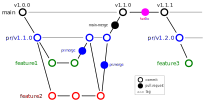

# Summary

The use of state-of-the-art machine learning tools for innovative structural and materials design has demonstrated their potential in various studies `[@Aage:2017; @Schelling:2021]`. Although these specific applications may differ, the data-driven modelling and optimization process remains the same. However, a comprehensive framework for data-driven design has not yet been established in the literature. Therefore, the framework for data-driven design and analysis of structures and materials (`f3dasm`) is an attempt to develop a systematic approach of inverting the material design process. The framework integrates the following fields:

- Design of experiments, in which input variables describing the microstructure, structure, properties and external conditions of the system to be evaluated are determined and sampled.
- Data generation, typically through computational analysis, resulting in the creation of a material response database.
- Machine learning, in which a surrogate model is trained to fit experimental findings.
- Optimization, where we try to iteratively improve the model to obtain a superior design.

The effectiveness of the pre-released version of the `f3dasm` framework (`[@Bessa:2017]`) has been demonstrated in various computational mechanics and materials studies, such as the design of a super-compressible meta-material `[@Bessa:2019]` and a spiderweb nano-mechanical resonator inspired by nature and guided by machine learning \cite`[@Shin:2022]`. 

<!-- The concepts outlined in the initial paper will serve as the basis for our ongoing research in materials design, as we investigate optimization strategies for both high-dimensional design spaces and data-scarce black-box problems. -->

# Coding framework

## Design

By abstracting away the details of specific implementations, users and developers can better organize and reuse their code, making it easier to understand, modify, and share with others. Within the `f3dasm` framework, abstraction is done in four levels:

- **block**: blocks represent one of the high-level stages that can be used in the framework, e.g. the submodule `f3dasm.optimization`. They can be put in any specific order, and incorporate a core action undertaken by the design.
- **base**: bases represent an abstract class of an element in the block, e.g. the `f3dasm.optimization.Optimizer` class. Base classes are used to create a unified interface for specific implementations and are inherited from blocks.
- **implementation**: implementations are application of a base class feature, e.g. the `f3dasm.optimization.Adam` optimizer. These can be self-coded or ported from other Python libraries.
- **experiment**: experiments represent executable programs that uses a certain order of blocks and specific implementations to generate results. An example of how an experiment looks like is given in \autoref{fig:f3dasm-example}.

An overview of the different levels of abstraction is given in \autoref{fig:f3dasm-blocks} and an example of a experiment representing different blocks with implementations is given in \autoref{fig:f3dasm-example}.

## Testing

The pagmo development team places a strong emphasis on automated testing. The code
is fully covered by unit tests, and the continuous integration pipeline checks that the code
compiles and runs correctly on a variety of operating systems (Linux, OSX, Windows) using
different compilers (GCC, Clang, MSVC). 

## Documentation

Code documentation is essential for facilitating the comprehension of a software
system by developers, maintainers, and users. It serves to provide information about the functionality,
structure, dependencies, and requirements of the code. To improve the usability of the f3dasm frame­work,
thorough documentation has been included with the Sphinx package. Documentation for this package can be accessed
on [the homepage](https://bessagroup.github.io/F3DASM/) and will be maintained with the
latest release of the package.

The Python API is fully documented, and as a policy we require that every PR f3dasm must not lower the
testing coverage under 80%.

##  Open-source collaborative development

The f3dasm framework relies on the collaborative efforts of scientists and developers to expand its capabilities. In order to ensure the quality of the code and facilitate a smooth collaborative process, it is essential to have a well-defined software development process in place. This can be achieved by maintaining strict branching policies, and incorporating comprehensive testing suites and automatic continuous integration with GitHub Workflows. These measures help to safeguard the quality of the code, making it easier for scientists and developers to work together effectively. 

The f3dasm framework will maintain three types of branches:

- main branch: the stable version of the software, intended for users of the package. Each commit is tagged with a version (e.g. `v1.0.0`), and this branch will be distributed as a Python package.
- pull-request branches: short-lived development branches for each development cycle (e.g. `pr/v1.1.0`), intended for active development. At the end of each development cycle, an attempt is made to merge the pull-request branch with the main branch.
- feature branches: working branches intended for implementing individual features or resolving issues/bugs.

Figure \autoref{fig:gitbranching} illustrates the branching tree of the version control strategy.

To maintain the integrity of the framework, various (automatic) validation procedures are implemented during the merging procedure of various branches.

# Availability

`f3dasm` is available as a `pip` package and is compatible with Python 3.8 to 3.10 and all major operating systems (Linux, MacOS and Windows). Detailed installation instructions can be found on the ['Getting Started' page](https://bessagroup.github.io/F3DASM/). 

# Acknowledgements

I would like to thank ..

# References

<!-- # Statement of need

`Gala` is an Astropy-affiliated Python package for galactic dynamics. Python
enables wrapping low-level languages (e.g., C) for speed without losing
flexibility or ease-of-use in the user-interface. The API for `Gala` was
designed to provide a class-based and user-friendly interface to fast (C or
Cython-optimized) implementations of common operations such as gravitational
potential and force evaluation, orbit integration, dynamical transformations,
and chaos indicators for nonlinear dynamics. `Gala` also relies heavily on and
interfaces well with the implementations of physical units and astronomical
coordinate systems in the `Astropy` package [@astropy] (`astropy.units` and
`astropy.coordinates`).

`Gala` was designed to be used by both astronomical researchers and by
students in courses on gravitational dynamics or astronomy. It has already been
used in a number of scientific publications [@Pearson:2017] and has also been
used in graduate courses on Galactic dynamics to, e.g., provide interactive
visualizations of textbook material [@Binney:2008]. The combination of speed,
design, and support for Astropy functionality in `Gala` will enable exciting
scientific explorations of forthcoming data releases from the *Gaia* mission
[@gaia] by students and experts alike.

# Mathematics

Single dollars ($) are required for inline mathematics e.g. $f(x) = e^{\pi/x}$

Double dollars make self-standing equations:

$$\Theta(x) = \left\{\begin{array}{l}
0\textrm{ if } x < 0\cr
1\textrm{ else}
\end{array}\right.$$

You can also use plain \LaTeX for equations
\begin{equation}\label{eq:fourier}
\hat f(\omega) = \int_{-\infty}^{\infty} f(x) e^{i\omega x} dx
\end{equation}
and refer to \autoref{eq:fourier} from text.

# Citations

Citations to entries in paper.bib should be in
[rMarkdown](http://rmarkdown.rstudio.com/authoring_bibliographies_and_citations.html)
format.

If you want to cite a software repository URL (e.g. something on GitHub without a preferred
citation) then you can do it with the example BibTeX entry below for @fidgit.

For a quick reference, the following citation commands can be used:
- `@author:2001`  ->  "Author et al. (2001)"
- `[@author:2001]` -> "(Author et al., 2001)"
- `[@author1:2001; @author2:2001]` -> "(Author1 et al., 2001; Author2 et al., 2002)"

# Figures

Figures can be included like this:

and referenced from text using \autoref{fig:example}.

Figure sizes can be customized by adding an optional second parameter:
{ width=20% } -->
