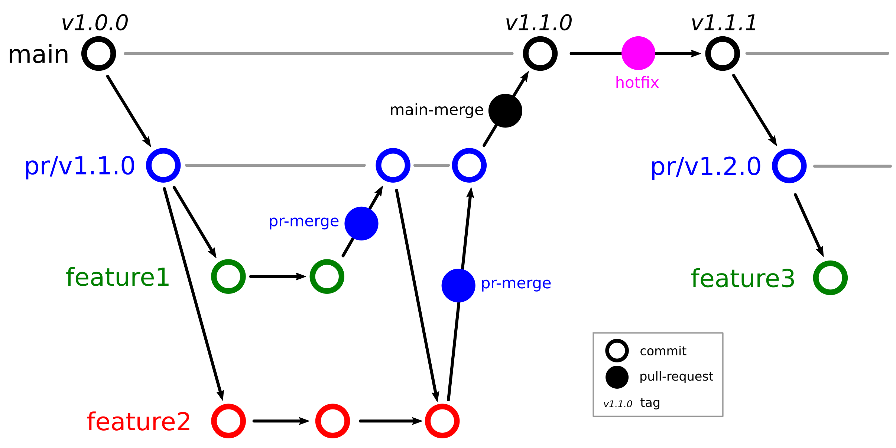

# Summary
<!-- A summary describing the high-level functionality and purpose of the software for a diverse, non-specialist audience. -->

The process of structural and materials design involves a continuous search for the most efficient design based on specific criteria. The different boundary conditions applied to the material or structure can result in vastly different optimal compositions. In particular, the design of materials is faced with a high-dimensional solution space due to the overwhelming number of potential combinations that can create distinct materials. Unfortunately, this extensive design space poses a significant challenge to accelerate the optimization process. The immense number of possibilities makes it impractical to conduct experimental investigations of each concept. As a result, data-driven computational analyses have been a method of interest for efficiently traversing these design spaces.

Most applied fields such as Mechanical Engineering have remained conservative when it comes to openly sharing databases and software [can you find a couple of references backing this up?]. This is in sharp contrast to the Computer Science community, especially within the sub-field of machine learning. Understandably, the entry barrier is higher for researchers and practitioners from applied fields that are not specialized in software development. In this work we developed a general and user-friendly data-driven package for researchers and practitioners working on design and analysis of materials and structures. The package is called `f3dasm` (framework for data-driven design & analysis of structures and materials) and it aims at democratizing the data-driven process and making it easier to replicate research articles in this field, as well as sharing new work with the community. This work generalizes the original closed-source framework proposed by the senior author and his co-workers [@Bessa2017], making it more flexible and adaptable to different applications, allowing to integrate different choices of software packages needed in the different steps of the data-driven process: (1) design of experiments; (2) data generation; (3) machine learning; and (4) optimization.

<!-- Although specific applications may differ, the data-driven modelling and optimization process remains the same, as illustrated in \autoref{fig:f3dasm-overview}. We introduce a software library based on the framework for data-driven design and analysis of structures and materials (`f3dasm`) [@Bessa2017]: a systematic approach for inverting the material design process.

Therefore, we introduce the framework for data-driven design and analysis of structures and materials (`f3dasm`): an attempt to develop a systematic approach of inverting the material design process.  -->
<!-- 
![Schematic of global framework for data-driven material systems design/modeling [@Bessa2017].\label{fig:f3dasm-overview}](f3dasm_bessa_overview.png) -->

# Statement of need
<!-- A Statement of need section that clearly illustrates the research purpose of the software and places it in the context of related work. -->

The use of state-of-the-art data-driven methods for innovative structural and materials design has demonstrated their potential in various studies [@Aage2017; @Schelling2021]. The `f3dasm` framework is aimed at researchers who seek to develop such data-driven methods for structural & material modeling by incorporating modern machine learning tools. The framework integrates the following fields:

- Design of experiments, in which input variables describing the microstructure, structure, properties and external conditions of the system to be evaluated are determined and sampled;
- Data generation, typically through computational analysis, resulting in the creation of a material response database;
- Machine learning, in which a surrogate model is trained to fit experimental findings;
- Optimization, where we try to iteratively improve the model to obtain a superior design.

`f3dasm` is designed as a *modular* framework, consisting of both core and extended features, allowing user-specific instantiations of one or more steps from the above list.

The *core* functionality of the framework comprises the following features:

- provide a way to parametrize experiments with the design-of-experiments functionalities;
- enabling experiment exploration by means of sampling and design optimization;
- provide the user tools for parallelizing their program and ordering their data;
- Allowing users to deploy experiments on high-performance computer systems (TORQUE Resource Manager).

The *extensions* can be installed on the fly and contain the following features:

- provide various implementations to accommodate common data-driven workflows;
- adapter classes that link popular machine learning libraries to be used as implementations in `f3dasm`.

The Python package includes extensive implementations for each of the provided fields and are organized in an object-oriented way. \autoref{fig:f3dasm-blocks} illustrates the package organization and levels of abstraction. Studies represent reproducible programs that uses the data-driven process with specific implementations in a script-like manner.

The effectiveness of the pre-released version of the `f3dasm` framework [@Bessa2017] has been demonstrated in various computational mechanics and materials studies, such as the design of a super-compressible meta-material [@Bessa2019] and a spiderweb nano-mechanical resonator inspired by nature and guided by machine learning [@Shin2022]. 

<!-- A paragraph where you describe the way you expect the user to use f3dasm to perform its own project (almost like an imitation) -->
<!-- Say something about how your package will make it easier to structure & perform such studies -->

<!-- # Coding framework -->

<!-- 
Since its creation, the code has not received any major updates and lacked active development. This presented an opportunity for growth as the original authors aim to achieve a unified framework. In order to reincarnate the framework and enhance its usability, a complete comprehensive redesign has been conducted. Key objectives that have been addressed include:

- The incorporation and abstraction of various elements of the data-driven process.
- The creation of a user-friendly and thoroughly documented code base.
- The development of an open-source platform for sharing and contributing to reproducible studies using the data-driven framework. -->

<!-- 
## Design

By abstracting away the details of specific implementations, users and developers can better organize and reuse their code, making it easier to understand, modify, and share with others. Within the `f3dasm` framework, abstraction is done in four levels:

- **block**: blocks represent the high-level stages that can be used in the framework, e.g. the submodule `f3dasm.optimization`. They incorporate a core action undertaken by the data-driven process.
- **base**: bases represent abstract classes of an element in the block, e.g. the `f3dasm.optimization.Optimizer` class. Base classes are used to create a unified interface for specific implementations.
- **implementation**: implementations are applications of a base class feature, e.g. the `f3dasm.optimization.Adam` optimizer.
- **study**: studies represent reproducible programs that uses a certain order of blocks with specific implementations in a script-like manner.

An overview of the different levels of abstraction is given in \autoref{fig:f3dasm-blocks}.

 -->

<!--  -->

# Documentation and collaborative development

To improve the usability of the `f3dasm` frame­work, thorough documentation has been included with the Sphinx package. Documentation for this package can be accessed on [the homepage](https://bessagroup.github.io/f3dasm/) and will be kept up to date with the latest release of the package.

The `f3dasm` framework relies on the collaborative efforts of scientists and developers to expand its capabilities. Therefore, it is essential to have a well-defined software development process in place. This is achieved by maintaining strict branching policies, and incorporating comprehensive testing suites and automatic continuous integration with GitHub Workflows.

<!-- ##  Open-source collaborative development

The `f3dasm` framework relies on the collaborative efforts of scientists and developers to expand its capabilities. In order to ensure the quality of the code and facilitate a smooth collaborative process, it is essential to have a well-defined software development process in place. This can be achieved by maintaining strict branching policies, and incorporating comprehensive testing suites and automatic continuous integration with GitHub Workflows. These measures help to safeguard the quality of the code, making it easier for scientists and developers to work together effectively. 

The `f3dasm` framework will maintain three types of branches:

- **main branch**: the stable version of the software, intended for users of the package. Each commit is tagged with a version (e.g. `v1.0.0`), and this branch will be distributed as a Python package.
- **pull-request branches**: short-lived development branches for each development cycle (e.g. `pr/v1.1.0`), intended for active development. At the end of each development cycle, an attempt is made to merge the pull-request branch with the main branch.
- **feature branches**: working branches intended for implementing individual features or resolving issues/bugs.

\autoref{fig:gitbranching} illustrates the branching tree of the version control strategy.

To maintain the integrity of the framework, various (automatic) validation procedures are implemented during the merging procedure of various branches. -->

# Availability

`f3dasm` and its extensions are available as a `pip` package and is compatible with Python 3.8 to 3.10 and all major operating systems (Linux, MacOS and Windows). Detailed installation instructions can be found on the ['Getting Started'](https://bessagroup.github.io/f3dasm/general/gettingstarted.html) documentation page. 

# Acknowledgements

We would express our gratitude to Jiaxiang Yi for his contributions to writing an interface with Abaqus simulation software.

# References