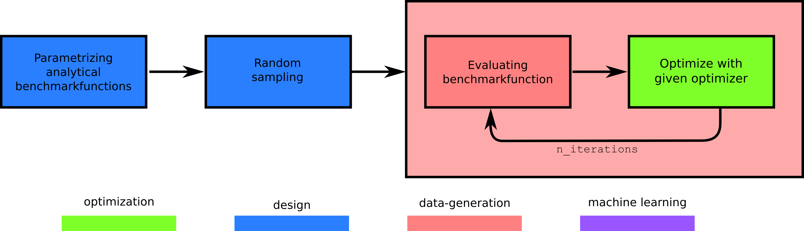
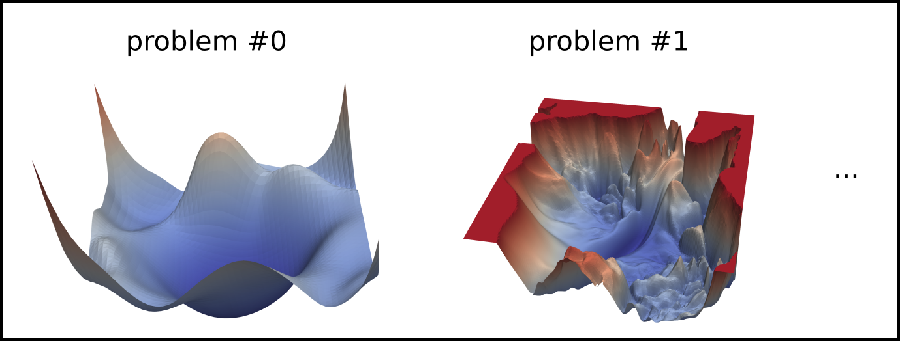

# Comparing optimization algorithms on benchmark functions

<center>

</center>

## Summary

We create a dataset with the performance of different optimization algorithms on different optimization problems.

The dataset is created by solving a set of parametrized benchmark functions with a set of optimization algorithms. The benchmark functions are parametrized by their analytical formula, dimensionality, noise, and seed:

<center>

</center>

The benchmark function is optimized for a given number of iterations and repeated with different initial conditions (realizations). The results are stored in a [NetCDF](https://docs.xarray.dev/en/stable/user-guide/io.html#netcdf) (`.nc`) file.

## Contents of this folder

| File/Folder | Description |
|-------------|-------------|
| `main.py` | Main script to run the experiment |
| `config.yaml` | Configuration file for the experiment |
| `README.md` | Explanation of this experiment |
| `img/` | Folder with images used in this file |
| `pbsjob.sh` | TORQUE job file to run the experiment in a cluster |
| `outputs/` | Folder with the results of running this experiment |

> The `outputs/` folder is created when the experiment has been run for the first time.

## Usage

### Before running the experiment

1. Install `f3dasm_optimize` in your environment. See [here](https://f3dasm-optimize.readthedocs.io/en/latest/) for instructions.
3. Change the `config.yaml` file to your liking. See [here](#explanation-of-configyaml-parameters) for an explanation of the parameters.

### Running the experiment on your local machine

1. Navigate to this folder and run `python main.py`

### Running the experiment on a TORQUE cluster

1. Make sure you have an `conda` environment named `f3dasm_env` with the packages installed in the first step
2. Navigate to this folder and submit the job with i.e. 2 nodes: `qsub pbsjob.sh -t 0-2`


## Results

Results are stored in a newly created `outputs` folder, with a subdirectory
indicating the current date (e.g. `2023-11-06`).

* When running on a local machine, the output will be saved in a directory indicating the current time (e.g. `13-50-14`).
* When running on a cluster, the output will be saved in a directory indicating the current job ID (e.g. `538734.hpc06.hpc`).

The following subdirectories are created:

* `experiment_data`: Contains the input, output, domain and jobs to construct the [`f3dasm.ExperimentData`](https://f3dasm.readthedocs.io/en/latest/rst_doc_files/classes/design/experimentdata.html) object.
* `<opt_name>`: Contains a [NetCDF](https://docs.xarray.dev/en/stable/user-guide/io.html#netcdf) (`.nc`) file with the optimization results for each optimization problem. The folder name is the concatenation of the two optimization algorithms used.
* `.hydra`: Contains the `config.yaml` file used to run the experiment.

Lastly, a log file `main.log` is created.

The folder structure is as follows:

```
outputs/
└── 2023-11-06/
    └── 13-50-14/
        ├── .hydra/
        ├── PSO/
        ├── LBFGSB/
        ├── CMAES/
        │   ├── 0.nc
        │   ├── 1.nc
        │   └── 2.nc
        ├── experiment_data/
        │   ├── domain.pkl
        │   ├── input.csv
        │   ├── output.csv
        │   └── jobs.pkl
        └── main.log
```


## Explanation of `config.yaml` parameters

### Domain
#### Function Name
| Name       | Type     | Description                |
|------------|----------|----------------------------|
| categories | `List[str]`     | List of benchmark functions ([reference](https://f3dasm.readthedocs.io/en/latest/rst_doc_files/classes/datageneration/functions.html)) |

#### Dimensionality
| Name       | Type     | Description                |
|------------|----------|----------------------------|
| categories | `List[int]`     | List of possible values of the function dimensionality |

#### Noise
| Name       | Type     | Description                |
|------------|----------|----------------------------|
| categories | `List[float]`     | List of possible values of the function noise standard deviation    |

#### Seed
| Name | Type | Description         |
|------|------|---------------------|
| low  | `int`  | Lower bound value of random seeds    |
| high | `int`  | Upper bound value of random seeds    |

#### Budget
| Name  | Type     | Description           |
|-------|----------|-----------------------|
| value | `int`      | Maximum number of iterations          |

### Experiment Data
#### From Sampling
| Name         | Type   | Description            |
|--------------|--------|------------------------|
| seed         | `int`    | Seed value              |
| n_samples    | `int`    | Number of samples       |
| domain       | `f3dasm.Domain` | `f3dasm` Domain object ([reference](https://f3dasm.readthedocs.io/en/latest/rst_doc_files/classes/design/domain.html))            |

### Mode
| Name  | Type   | Description |
|-------|--------|-------------|
| mode  | string | Evaluation mode of `f3dasm` ([reference](https://f3dasm.readthedocs.io/en/latest/rst_doc_files/classes/datageneration/datagenerator.html#)) |

### Optimization
| Name                       | Type     | Description               |
|----------------------------|----------|---------------------------|
| lower_bound                | `float`    | Box-constraint lower bound for every dimension |
| upper_bound                | `float`    | Box-constraint upper bound for every dimension |
| sampler_name               | `str`   | Name of the sampling strategy for the first iterations ([reference](https://f3dasm.readthedocs.io/en/latest/rst_doc_files/classes/sampling/sampling.html#id2)) |
| number_of_samples          | `int`      | Number of initial samples ($\vec{x}_0$)          |
| realizations               | `int`      | Number of realizations with different initial conditions    |
| optimizers                 | `List[str]`     | List of dictionaries. Each dictionary contains a key ``name`` with the optimizer name ([from `f3dasm`](https://f3dasm.readthedocs.io/en/latest/rst_doc_files/classes/optimization/optimizers.html#implemented-optimizers), [and `f3dasm_optimize`](https://f3dasm-optimize.readthedocs.io/en/latest/)) and a (optionally) a ``hyperparameters`` key to overwrite hyper-parameters of that specific optimzier.      |


### HPC
| Name   | Type | Description  |
|--------|------|--------------|
| jobid[^2]  | `int`  | Job ID of the array-job, automatically overwritten by scheduler bash script |

[^2]: When running on a local machine, this value will be left as the default: -1.

### Log Level
| Name      | Type | Description     |
|-----------|------|-----------------|
| log_level | `int`  | Log level value ([see `logging` module for more info](https://docs.python.org/3/library/logging.html#logging-levels)) |
