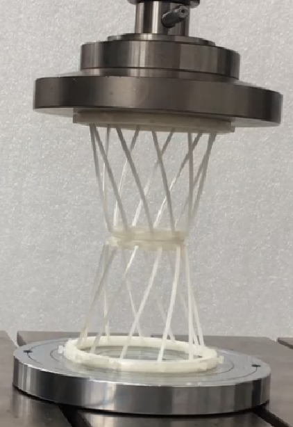
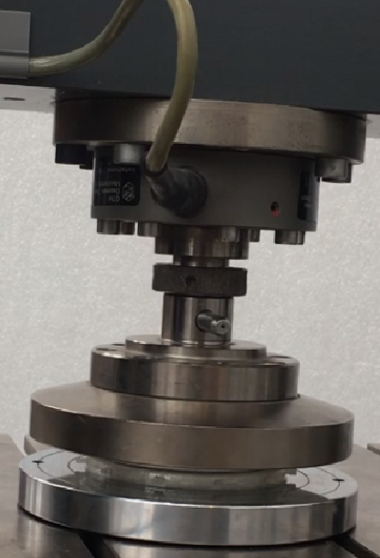
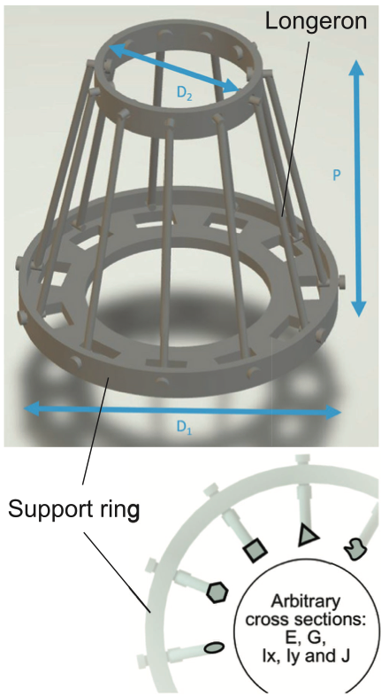

# Fragile becomes supercompressible

<div style="display: flex;">
    
    
    
</div>

<br>

This study is based on the work of [Bessa et al. (2019)](https://onlinelibrary.wiley.com/doi/full/10.1002/adma.201904845) and aims to reproduce the results of the paper using the `f3dasm` package.
## Summary

For years, creating new materials has been a time consuming effort that requires significant resources because we have followed a trial-and-error design process. Now, a new paradigm is emerging where machine learning is used to design new materials and structures with unprecedented properties. Using this data-driven process, a new super-compressible meta-material was discovered despite being made of a fragile polymer.

The above figure shows the newly developed meta-material prototype that was designed with the above-mentioned computational data-driven approach and where experiments were used for validation, not discovery. This enabled the design and additive manufacturing of a lightweight, recoverable and super-compressible meta-material achieving more than 90% compressive strain when using a brittle base material that breaks at around 4% strain. Within minutes, the machine learning model was used to optimize designs for different choices of base material, length-scales and manufacturing process. Current results show that super-compressibility is possible for optimized designs reaching stresses on the order of 1 kPa using brittle polymers, or stresses on the order of 20 MPa using carbon like materials.

#### Design of experiments

The supercompressible meta-material is parameterized by 5 geometric parameters and 2 material parameters. The geometry is defined by the top and bottom diameters, $D_1$ and $D_2$, the height $P$ and the cross-section parameters of the vertical longerons: the cross-sectional area $A$, moments of inertial $I_x$ and $I_y$, and torsional constant $J$. The isotropic material is defined by its elastic constants: Young's modulus $E$ and shear modulus $G$.

<center>

</center>

<br>

Due to the principle of superposition both the geometric and material parameters can be scaled by one of its dimensions/properties (here $D_1$ and $E$). Therefore, the variables that you will find in the dataset are:

$$
\frac{D_1-D_2}{D_1},\ \frac{P}{D_1},\ \frac{I_x}{D_1^4},\ \frac{I_y}{D_1^4},\ \frac{J}{D_1^4},\ \frac{A}{D_1^2}, \frac{G}{E}
$$

| expression |	parameter name |
| ----------- | --------------- |
| $\frac{D_1-D_2}{D_1}$ |	`ratio_top_diameter`
|$\frac{P}{D_1}$|	`ratio_pitch`
|$\frac{I_x}{D_1^4}$|	`ratio_Ixx`
|$\frac{I_y}{D_1^4}$|	`ratio_Iyy`
|$\frac{J}{D_1^4}$|	`ratio_J`
|$\frac{A}{D_1^2}$|	`ratio_area`
|$\frac{G}{E}$|	`ratio_shear_modulus`

This is a 7-dimensional problem and learning the response surface may require a significant amount of training points[^1]. Therefore, you will also consider a simpler version of the problem in 3 dimensions, defined by constraining the longerons' cross-section to be circular with diameter $d$, and choosing a particular material, leading to the following 3 features:

$$
\frac{d}{D_1}, \frac{D_2-D_1}{D_1},\ \frac{P}{D_1}
$$

| expression |	parameter name |
| ----------- | --------------- |
$\frac{D_1-D_2}{D_1}$|	`ratio_top_diameter`
$\frac{P}{D_1}$	|`ratio_pitch`
$\frac{d}{D_1}$	|`ratio_d`

[^1]: Remember the "curse of dimensionality"!


## Contents of this folder

| File/Folder | Description |
|-------------|-------------|
| `main.py` | Main script to run the experiment |
| `config.yaml` | Configuration file for the experiment |
| `README.md` | Explanation of this experiment |
| `img/` | Folder with images used in this file |
| `pbsjob.sh` | TORQUE job file to run the experiment in a cluster |
| `outputs/` | Folder with the results of running this experiment |

> The `outputs/` folder is created when the experiment has been run for the first time.

## Usage

### Before running the experiment

1. Install the `abaqus2py` package. See [here](https://github.com/bessagroup/abaqus2py) for instructions.
2. Change the `config.yaml` file to your liking. See [here](#explanation-of-configyaml-parameters) for an explanation of the parameters.

### Running the experiment on your local machine

1. Navigate to this folder and run `python main.py`

### Running the experiment on a TORQUE cluster

1. Make sure you have an `conda` environment named `f3dasm_env` with the packages installed in the first step
2. Navigate to this folder and submit the job with i.e. 2 nodes: `qsub pbsjob.sh -t 0-2`


## Results

Results are stored in a newly created `outputs` folder, with a subdirectory
indicating the current date (e.g. `2023-11-06`).

* When running on a local machine, the output will be saved in a directory indicating the current time (e.g. `13-50-14`).
* When running on a cluster, the output will be saved in a directory indicating the current job ID (e.g. `538734.hpc06.hpc`).

The following subdirectories are created:

* `experiment_data`: Contains the input, output, domain and jobs to construct the [`f3dasm.ExperimentData`](https://f3dasm.readthedocs.io/en/latest/rst_doc_files/classes/design/experimentdata.html) object.
* `.hydra`: Contains the `config.yaml` file used to run the experiment.
* `lin_buckle` and `riks`: Contain the ABAQUS simulation results for the linear buckling and Riks analysis, respectively.


Lastly, a log file `main.log` is created.

The folder structure is as follows:

```
outputs/
└── 2023-11-06/
    └── 13-50-14/
        ├── .hydra/
        ├── experiment_data/
        │   ├── domain.pkl
        │   ├── input.csv
        │   ├── output.csv
        │   └── jobs.pkl
        ├── lin_buckle/
        │   ├── 0/
        │   ├── 1/
        │   └── 2/
        ├── riks/
        │   ├── 0/
        │   ├── 1/
        │   └── 2/
        ├── loads/
        │   ├── 0.npy
        │   ├── 1.npy
        │   └── 2.npy
        ├── max_disps/
        │   ├── 0.ny
        │   ├── 1.npy
        │   └── 2.npy
        └── main.log
```

## Explanation of `config.yaml` parameters

There are two different configurations for this experiment:
 - The full 7-dimensional problem as defined in the paper
- The 3-dimensional problem, defined by constraining the longerons' cross-section to be circular with diameter $d$ and choosing a fixed material.

### Common problem domain

#### young_modulus
| Name       | Type     | Description                |
|------------|----------|----------------------------|
| value | `float`     | Young's modulus value |

#### n_longerons
| Name       | Type     | Description                |
|------------|----------|----------------------------|
| value | `float`     | Number of longerons in the design |

#### bottom_diameter ($D_2$)
| Name       | Type     | Description                |
|------------|----------|----------------------------|
| value | `float`     | Bottom diameter of the design |

#### ratio_top_diameter ($\frac{D_1-D_2}{D_1}$)
| Name       | Type     | Description                |
|------------|----------|----------------------------|
| low | `float`     | Lower bound of top diamater ratio |
| high | `float`     | Upper bound of top diamater ratio |

#### ratio_pitch ($\frac{P}{D_1}$)
| Name       | Type     | Description                |
|------------|----------|----------------------------|
| low | `float`     | Lower bound of the pitch ratio |
| high | `float`     | Upper bound of the pitch ratio |

### 3 dimensional problem domain


#### ratio_d ($\frac{d}{D_1}$)
| Name       | Type     | Description                |
|------------|----------|----------------------------|
| low | `float`     | Lower bound of longerons cross-section |
| high | `float`     | Upper bound of longerons cross-section |

#### ratio_shear_modulus ($\frac{G}{E}$)
| Name       | Type     | Description                |
|------------|----------|----------------------------|
| value | `float`     | Lower bound of shear modulus ratio |

### 7 dimensional problem domain

#### ratio_area ($\frac{A}{D_1^2}$)
| Name       | Type     | Description                |
|------------|----------|----------------------------|
| low | `float`     | Lower bound of the area ratio |
| high | `float`     | Upper bound of the area ratio |

#### ratio_Ixx ($\frac{I_x}{D_1^4}$)
| Name       | Type     | Description                |
|------------|----------|----------------------------|
| low | `float`     | Lower bound of the $I_{xx}$ ratio |
| high | `float`     | Upper bound of the $I_{xx}$ ratio |

#### ratio_Iyy ($\frac{I_y}{D_1^4}$)
| Name       | Type     | Description                |
|------------|----------|----------------------------|
| low | `float`     | Lower bound of the $I_{yy}$ ratio |
| high | `float`     | Upper bound of the $I_{yy}$ ratio |

#### ratio_J ($\frac{J}{D_1^4}$)
| Name       | Type     | Description                |
|------------|----------|----------------------------|
| low | `float`     | Lower bound of the $J$ ratio |
| high | `float`     | Upper bound of the $J$ ratio |

#### ratio_shear_modulus ($\frac{G}{E}$)
| Name       | Type     | Description                |
|------------|----------|----------------------------|
| low | `float`     | Lower bound of shear modulus ratio |
| high | `float`     | Upper bound of shear modulus ratio |


#### circular
| Name       | Type     | Description                |
|------------|----------|----------------------------|
| value | `bool`     | If the design is simplified or not |

...

### Experiment Data
#### from Sampling
| Name         | Type   | Description            |
|--------------|--------|------------------------|
| sampler      | `str` | Sampler name            |
| seed         | `int`    | Seed value              |
| n_samples    | `int`    | Number of samples       |
| domain       | `f3dasm.Domain` | `f3dasm` Domain object ([reference](https://f3dasm.readthedocs.io/en/latest/rst_doc_files/classes/design/domain.html))            |

### mode
| Name  | Type   | Description |
|-------|--------|-------------|
| mode  | string | Evaluation mode of `f3dasm` ([reference](https://f3dasm.readthedocs.io/en/latest/rst_doc_files/classes/datageneration/datagenerator.html#)) |


### hpc
| Name   | Type | Description  |
|--------|------|--------------|
| jobid[^2]  | `int`  | Job ID of the array-job, automatically overwritten by scheduler bash script |

[^2]: When running on a local machine, this value will be left as the default: -1.

### imperfection

| Name         | Type   | Description            |
|--------------|--------|------------------------|
| mean      | `float` | Mean value of lognormal distribution |
| std         | `float`    | Standard deviation value of lognormal distribution |

### scripts

| Name         | Type   | Description            |
|--------------|--------|------------------------|
| lin_buckle_pre      | `str` | Absolute path of linear buckling script |
| lin_buckle_post         | `str`    | Absolute path of linear buckling post-processing script |
| riks_pre      | `str` | Absolute path of RIKS analysis script |
| riks_post         | `str`    | Absolute path of RIKS analysis post-processing script |


### Logging
| Name      | Type | Description     |
|-----------|------|-----------------|
| log_level | `int`  | Log level value ([see `logging` module for more info](https://docs.python.org/3/library/logging.html#logging-levels)) |
